# COYOTE REQUIEM
**GAME DESIGN DOCUMENT**

Eduardo Almarza Blasco • Antonio Bernal de Celis • David del Castillo Enríquez • Diego Fernández Manso • Candela Jiménez González • Andrea Luengo Zazo

Version 3.0

# 0. Introducción
**Este documento presenta el diseño y desarrollo del videojuego Coyote Requiem, donde se expondrá el proceso creativo a lo largo del tiempo hasta su lanzamiento final.**

Coyote Requiem es un juego de acción frenética en 3D con cámara en tercera persona, centrado en la gestión de múltiples enemigos y el combate cuerpo a cuerpo. 

# 1. Concepto del juego 
Coyote Requiem es un videojuego donde el jugador tomará el papel de Coyote, un vaquero que busca revivir a su marido tras escuchar de una leyenda sobre una persona que intentó revivir a su madre en un oasis cerca de Pricklytown. Su viaje se complicará al llegar al poblado, que ha sido amenazado por una misteriosa infección desconocida que provoca mutaciones con forma de cactus en el cuerpo de quienes consumen el “sagrado” higo chumbo.

# 2. Historia
## 2.1. Ambientación 
Coyote Requiem se desarrolla en un viejo oeste fantástico y oscuro. En este mundo existen magias como la necromancia, criaturas sobrenaturales, animales antropomórficos, entre otros. 

La zona donde se desarrolla el videojuego es un área poblada en el desierto que se ha visto afectado por una misteriosa enfermedad que provoca mutaciones en el cuerpo y comportamientos agresivos.  

### Zonas de Coyote Requiem

  ####  Pricklytown
  Coyote llega inicialmente a Pricklytown, el único poblado de la zona. Se trata de un pequeño burgo muy aislado, habitado por diversas criaturas de personalidades extravagantes. Hay algunas viviendas, comercios variados,una iglesia, entre otros sitios de interés.

  ####  El Cañón
  Tras su visita por Pricklytown Coyote se ve obligado a viajar hacia el oasis del sur, accesible únicamente a través de un cañón. Se trata de una zona desértica, seca y vacía. Hay algunas cajas de madera y elementos de transporte, ya que esta ruta era empleada por los habitantes de Pricklytown para transportar agua antes de la construcción del pozo.

  ####  El Oasis
  El Oasis es una pequeña zona misteriosa y excesivamente frondosa. Los habitantes de Pricklytown afirman que, a pesar de contener agua, en el pasado prácticamente ninguna planta crecía en la zona, y que solo se conocía como oasis por tradición. Ahora es una exhuberante y densa jungla de todo tipo de cactus y plantas desérticas. En el oasis además hay una edificación puntiaguda que se asemeja a una iglesia.

  *Estos lugares, en cuestiones de gameplay, se traducen directamente como niveles o zonas de progreso que el jugador deberá atravesar*

## 2.2. Trasfondo
>*Existen manuscritos de eras ancestrales que teorizan sobre la existencia de unas cápsulas o huevos que surgieron con la creación del universo. En estas escrituras se les atribuye a estos huevos la capacidad de engendrar vida y alterar el entorno de su alrededor, consiguiendo habitar planetas yermos por completo.* 

### La sequía

En el periodo histórico actual, los habitantes de Pricklytown, un pequeño poblado en el desierto, excavaron un canal subterráneo para facilitar la llegada de agua desde un pequeño oasis cercano. Esta excavación interfirió con un artefacto extraño, de aspecto alienígena y orgánico que los mineros fueron incapaces de retirar y acabaron ignorando. 

Una vez inaugurado el canal, Pricklytown disfrutó de un corto periodo de abundancia gracias al nuevo acceso al manantial. Esta exhuberancia fue breve, pronto el agua escaseó, y tras una expedición, los vecinos del poblado descubrieron un bloqueo de vegetación en el oasis. 

Antes triste y prácticamente árido, el oasis se había transformado ahora en una jungla frondosa de vegetación desértica, con cactus y plantas que bloqueaban el aceso al agua. Este descubrimiento tenía un lado positivo para los vecinos, que pasaban por un periodo de hambruna, ya que este rápido crecimiento también había causado la fructificación de unos jugosos higos en los cactus a los que los habitantes de Pricklytown no pudieron resistirse.

Con el paso del tiempo las criaturas de la zona comenzaron a presentar malestar, aparentemente, debido al consumo del higo chumbo. Aquel que se alimentaba de los higos presentaba síntomas como deshidratación severa, cansancio y fiebre. Con el paso del tiempo, bultos y quistes verdosos brotaban en la piel y pronto se convertían en protuberancias vegetales y carnosas. 

### La expedición
El pueblo organizó una expedición formada por matasanos, voluntarios y miembros de la iglesia para investigar el cambiado oasis. Semanas después de su partida, menos de la mitad regresaron. Los expedicionarios parecían haber enloquecido y afirmaban que el consumo de el higo permitía a cualquier criatura alcanzar la inmortalidad.

Finalmente la misión fue considerada fallida y se atribuyeron los delirios de los supervivientes a la deshidratación.

### La llamada
Con el grave periodo de escasez al que se enfrentaba Pricklytown y la incomprensibilidad general de los efectos de los higos, resultó imposible evitar que los vecinos se alimentaran de ellos.
Quienes los consumían empeoraban con rapidez, y junto con los desagradables síntomas aparecían actitudes agresivas y destructivas. Los "infectados", como fueron etiquetados, eran trasladados recurrentemente al oasis por un culto surgido de aquellos expedicionistas.

### El origen de la leyenda

En medio de la situación crítica que pasada Pricklytown, un joven llamado Jimmy que había perdido a su madre antes de haberse transformado, empezó a escuchar los discursos de los sectarios pues, debido a su dolor, creyó con firmeza sus palabras que decían que en el oasis había una piedra capaz de devolver a la vida a los fallecidos.
Jimmy emprendió un viaje hacia el oasis, pero nunca más se volvió a saber de él
 
## 2.3. Personajes principales 

### Coyote

El protagonista de Coyote Requiem, Coyote, es un vaquero que se dirige al oasis de Pricklytown para enterrar las cenizas de su difunto marido. Se trata de un humano de 40 años, robusto, con una actitud ruda. En sus brazos posee unas ruedas de revolver que sirven para lanzar sus manos como si fueran un gancho. 

### Personajes no jugables (NPCs)

#### Denébola
Se trata de una habitante de Pricklytown que entrena a las afueras para poder internar hacer cara a los infectados que de vez en cuando ocupan el pueblo. Para entrenar usa un cactus con un papel que simula ser una cara que funciona como saco de boxeo. Además, es amiga del carretero.

#### El carretero
Este personaje aparece al final del primer nivel y es el encargado de llevar a Coyote al Coñón como recompensa por haber liberado a Pricklytown de los infectados, se trata de un perro humanoide dueño de un carro. Su papel en la trata es de consejero e intenta convencer a Coyote que abandone el camino del dolor.

#### Carlos
Carlos antes de convertirse en cactus era acompañante de un sheriff en busca de forajidos. Sus principales criminales buscados eran Coyote y Lince, pero al convertirse perdió parte de sus recuerdos y otros están borrosos.

#### Líder de la secta
Se trata de uno de los expedicionistas supervivientes que acabó sumiendo el liderazgo del nuevo culto a los cactus. Se trata de un ciervo humanoide infectado que intenta de forma “pacífica” atraer a la gente al oasis.

### Enemigos 

  
  

 *Planteamiento de siluetas*

### La infección
Los pocos doctores cuerdos que han sobrevivido a la infección han observado que su síntoma más vistoso es el crecimiento de protuberancias con forma de cactus en el cuerpo de la criatura afectada. Los infectados no parecen ser conscietes de sus acciones y aparentan obedecer a una fuerza extraña.

Los estados de transformación por el “milagro chungo” se han categorizado en 4 niveles según el tiempo que lleva el individuo enfermo. 

**Fases de contagio**

<table>
  <tr>
    <th style="width: 10%;">Fase</th>
    <th style="width: 70%;">Síntomas</th>
    <th style="width: 20%; text-align: center;">Aspecto</th>
  </tr>
  <tr>
    <td>1</td>
    <td>Primeros cinco días tras el consumo del higo. En este punto, los individuos no representan anomalías corporales, únicamente fiebre. El consumidor deja de tener hambre y sed y se siente saciado.</td>
    <td></td>
  </tr>
  <tr>
    <td>2</td>
    <td>En esta fase, a partir del quinto día hasta la segunda semana, el individuo empieza a presentar protuberancias en la piel, ahora áspera en la mitad superior del cuerpo, donde los pelos adoptan una postura rígida como si fueran espinas. Además de fiebre, los sujetos presentan síntomas de deshidratación, provocando en algunos casos diarrea.</td>
    <td></td>
  </tr>
  <tr>
    <td>3</td>
    <td>Tras las dos semanas del consumo del higo las protuberancias del nivel anterior crecen de forma significativa y obteniendo forma de cactus, el individuo presenta un nivel de deshidratación extremo provocando la desaparición de sus ojos. Su piel ha perdido su color natural y los síntomas del primer nivel han desaparecido. Los sujetos pierden el sentido del habla y tienen movimientos toscos.</td>
    <td></td>
  </tr>
  <tr>
    <td>4</td>
    <td>A este punto los individuos ya se vuelven irreconocibles. Su cuerpo presenta deformaciones extremas con forma de cactus, tienen un comportamiento agresivo y cuando están en grupo parecen seguir ordenes de algún modo.</td>
    <td></td>
  </tr>
</table>

 
 

# 3. Jugabilidad 
Al tratarse de un videojuego en 3D y tener un combate frenético donde te enfrentas a distintos enemigos, hay que tener en cuenta como se va a mover el jugador y como se va a enfrentar a estos enemigos. 

## 3.1. Mecánicas de interacción y movimiento
El jugador se desplaza en tres dimensiones en el escenario de juego y puede realizar las siguientes acciones: 

### **Desplazamiento horizontal**
El jugador puede desplazarse en cualquier dirección horizontalmente y correr de forma limitada mientras no tenga a ningún enemigo fijado.
### **Desplazamiento vertical** 
El personaje tiene un **gancho** que le ayuda con la movilidad y la gestión de enemigos. Además de engancharse a zonas concretas para moverse por el mapa. El jugador puede usar el gancho para atraer enemigos hacia él o para acercarse a ellos. Esto depende del botón que pulse el jugador, es decir, si usa el gancho y se mueve hacia delante irá donde esté el gancho, mientras que si se mueve para atrás lo que tenga el gancho será atraido hacia el jugador.

## 3.2. Sistema de combate y vida
### **Estilo duelo** 
El jugador puede fijar a un enemigo cuando está a cierta distancia pudiendo esquivar sus ataques (se muestra por pantalla la dirección del ataque). Si esquivas el ataque en el momento perfecto, el jugador realiza un parry bloqueando el ataque y stunneando al enemigo durante un muy corto periodo de tiempo. Habrá enemigos con ataques especiales que no se podrán esquivar o parrear obligando al jugador a desfijarlo para no recibir el daño. Al estar dentro de este estilo el jugador no se podrá mover por el escenario.

### **Ataque** 
El jugador puede atacar en varias direcciones.

  * Izquierda: input de ataque izquierdo (click izquierdo/...).

  * Derecha: input de ataque derecho (click derecho/...).

Si un jugador ataca en la misma dirección en la que un enemigo está bloqueando, esté podrá realizará un contratrataque al jugador poniendolo en un aprieto.

### **Esquives**
El jugador tendrá que esquivar los ataques de los enemigos para no sufrir demasiado daño. Estos ataques se categorizan en dos tipos:

- **Ataques primarios** Son los recibidos por el enemigo fijado. Pueden venir por la derecha, izquierda o centro. Para contrarrestarlos el jugador puede realizar las siguientes acciones:

  - **Esquive**: dentro de una ventana de frames, el jugador puede esquivar en la dirección indicada por la interfaz para no sufrir daño observando 3 posibles direcciones:
    
    * Izquierda: input de dirección izquierda (A/....).

    * Derecha: input de dirección derecha (D/....).

    * Detrás: input de esquive trasero(espacio/....)

    La dirección en la que el jugador tiene que esquivar viene indicada tanto en la interfaz como en la dirección física de la animación de ataque del enemigo. En caso de esquivar en una dirección contraria a la indicada el jugador recibirá daño. Así mismo, los enemigos también bloquearán los ataques del jugador bajo las mismas normas.

  - **Esquive perfecto**: un esquive en el momento exacto (con una ventana de frames más pequeña que el esquive normal) permite al jugador contraatacar como respuesta. Los esquives perfectos se realizan en las mismas direcciones que los esquives.

- **Ataques secundarios** Son los ejecutados por enemigos no fijados, que pueden atacarte por la espalda o dispararte.
  
  * Si el jugador no ha fijado ningún enemigo, puede esquivar ataques o disparos gracias a los frames de invulnerabilidad que otorga el esquive. Un esquive en el momento exacto puede ayudar a salir de la trayectoria del ataque o a omitirlo por completo si se hace correctamente.

  * Si el jugador tiene fijado a un enemigo, el resto entrarán en un estado de "Kung fu Circle", donde se turnarán para atacar al jugador de manera controlada, complicando los enfrentamientos con varios enemigos al mismo tiempo, pero haciéndolos plausibles. Si el jugador va a recibir un ataque o disparo de un enemigo no fijado mientras está en estado de combate, puede introducer el imput **esquivar detrás** para realizar un esquive que le protegerá de recibir daño.

De esta forma se recompensa por realizar esquives correctos, fomentando esto como mecánica principal de la jugabilidad de "Coyote Requiem".

  
*Boceto inicial de la interfaz de dirección*

### **Vida**
El jugador contará con 7 puntos de vida los cuales de pueden recargar de dos maneras:

 * **Contraataque**. Cuando recibes un ataque de un enemigo ya sea en el estilo duelo o no, los corazones quedan quitados correspondiendo al daño inflijido. Si el jugador realiza un esquive perfecto durante un combate fijado podrá recuperar la vida que le fue quitada. Si el jugador vuelve a recibir un ataque y no ha podido recuperar los corazones quitados, esos corazones desaparecerán y los corazones quitados pasarán a ser los inflijidos por el último ataque. Si un enemigo realiza un ataque que tiene más daño que corazones porta el jugador este morirá automaticamente.

 * **Matando enemigos**: al matar a un enemigo, este suelta una bola que equivale a ciertos puntos de vida dependiendo del enemigo.

  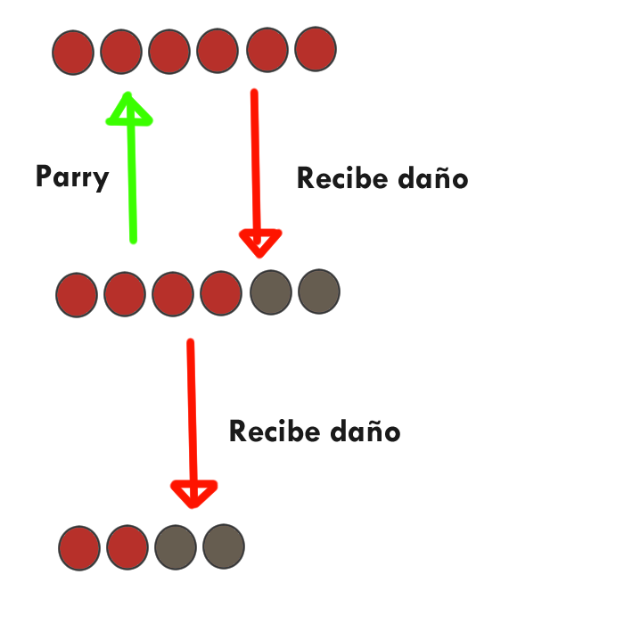

  *Boceto planteamiento funcionamiento vida*

### **Comportamiento enemigos**

El comportamiento de los enemigos varía dependiendo del lo que haga el jugador:

  * **Estado ilde**: Cuando los enemigos no detectan al jugador al estar fuera de su rango de visión u oculto, estarán en estado ilde dando vueltas o quedandose quietos realizando una animación predefinida. A este estado también volverán los enemigos cuando el jugador se aleje lo suficiente de estos tras ser detectado probocando que lo dejen de perseguir.

  * **Estado combate**: Si el jugador es detectado por un enemigo este le atacará a distancia o se acercará para pegarle. Si otros enemigos ven a uno de ellos ponerse en este modo buscarán al jugador para atacarle también.

## 3.3. Controles 
Estos serían los inputs asociados a las distintas acciones que puede realizar el jugador:

MECÁNICA              | TECLADO     | Dispositivos táctiles  |  Mando
--                    | --          | --                     |  --
MOVIMIENTO DE CÁMARA  | RATÓN       | Joystick tactil der.   |  Joystick der. 
MOVIMIENTO            | W,A,S,D     | Joystick tactil izq.   |  Joystick izq.
ENFOCAR               | Q           | Joystick tactil der.   |  L2
CORRER                | SHIFT       | Botón correr           |  R2
ACTIVAR GANCHO        | E           | Joystick tactil izq.   |  Joystick izq.
CAMBIAR OBJETIVO GAN. | W,A,S,D     | Botón activar gancho   |  R1
IR GANCHO             | W           | Joystick tactil izq.   |  Joystick izq.
ATRAER GANCHO         | S           | Joystick tactil izq.   |  Joystick izq.
LANZAR GANCHO         | CLICK IZQ.  | Botón lanzar gancho    |  Cuadrado
ATAQUE PRINCIPAL      | CLICK IZQ.  | Botón ataque           |  Cuadrado
ESQUIVE/PARRY         | A,D     | Botón esquive          |  Equis
DASH                  | ESPACIO     | Botón dash             |  Equis

Si se juega en movil los controles varían en función del modo de juego en el que estés:
* **Modo duelo**: al entrar en un combate se mostrará solo el joystick de movimiento, el botón de desfijado, el de ataque y el de esquivar.
* **Modo libre**: en este modo el jugador tendrá el joystick para moverse, el joystick para la cámara, el botón de fijado y el de usar el gancho.

## 3.4. Mecánicas de los enemigos 
En Coyote Requiem existen varios enemigos distintos que supondrán una amenaza para el jugador. Todos estos tienen comportamientos y mecánicas distintivas, haciendo el enfrentamiento con cada uno de ellos diferente.

### Dummy
Este no es un enemigo es sí. Se trata de un cactus que se utiliza en el tutorial, capaz de atacar y bloquear. Su uso es principalmente enseñar al jugador como combatir y jugar.

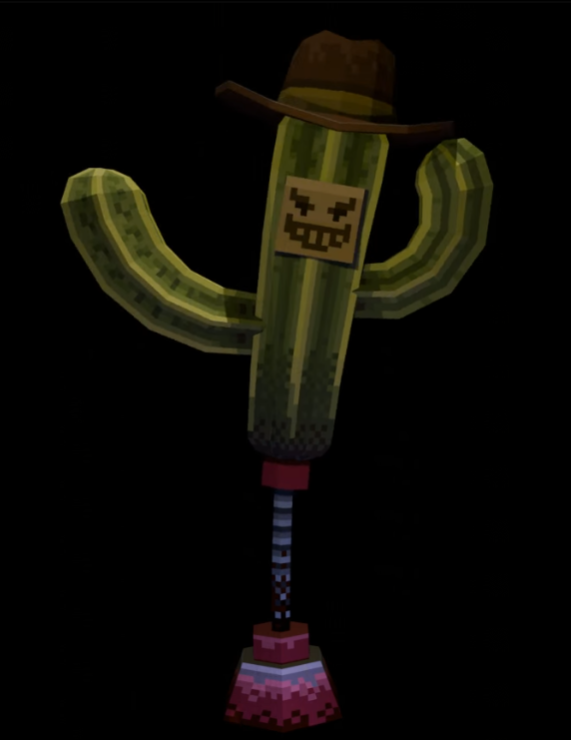

### Enemigos melee (Bandido Nopal)
Los enemigos melee como su nombre indica atacan a corta distancia. Son resistentes a los ataques y no poseen armas a distancia con las que atacar. Este tipo de enemigo pega con sus puchos. Tiene un total de 3 variantes, cada una correspondiente a un bioma de aparición.

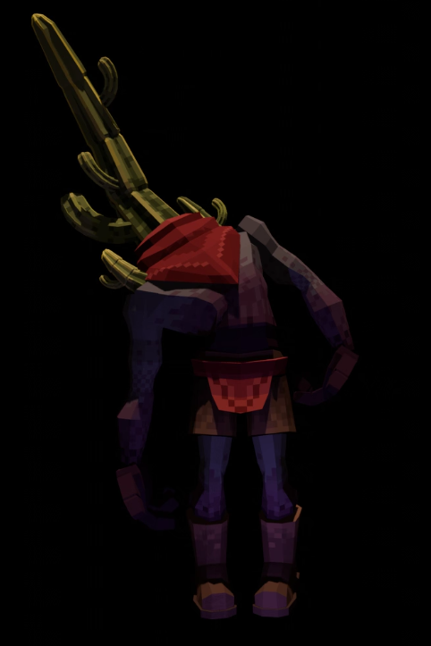

#### Melee Básico 
Este enemigo sirbe de seudotutorial al ser un enemigo sin ningún tipo de combos. Su aparición será principalmente en el primer nivel y cuenta con ataques y bloqueos básicos.

#### Melee Pricklytown (Variante 1)
Este enemigo se encuentra por el pueblo de Pricklytown. Sus ataques hacen 1 de daño y cuenta con 4 puntos de vida.  Posee un ataque (“ataque abrazo”) que solo se puede esquivar por el centro y si el jugador lo recibe se queda aturdido por unos segundos quedando expuesto a cualquier ataque. Sus patrones de ataque son:
  1. Bloque izquierdo y central, ataque central.
  2. Bloque izquierdo y central, ataque central y ataque izquierdo.
  3. Bloqueo total y "ataque abrazo".
  4. Ataque derecho, bloqueo derecho y ataque central

#### Melee Cañón (Variante 2)
Este enemigo se encuentra en la zona del cañón. Sus ataques hacen 1 de daño y cuenta con 4 puntos de vida. Al igual que la variante anterior posee un ataque (“ataque abrazo”) que solo se puede esquivar por el centro y si el jugador lo recibe se queda aturdido por unos segundos quedando expuesto a cualquier ataque. Sus patrones de ataque son:

  1. Bloqueo total y "ataque abrazo".
  2. Ataque derecho, ataque derecho y ataque izquierdo.
  3. Ataque derecho, ataque derecho, bloqueo derecho y ataque izquierdo.

#### Melee Oasis (Variante 3)

Este enemigo se encuentra en la zona del oasis. Sus ataques hacen 1 de daño y cuenta con 4 puntos de vida.Sus patrones de ataque son:

  1. Ataque derecho, ataque derecho y ataque izquierdo.
  2. Ataque central, bloqueo central y ataque derecho.
  3. Bloqueo izquierdo, ataque derecho y bloqueo derecho.

### Enemigo suicida (Sapobombo)
Este enemigo busca provocar el mayor daño posible al jugador. Cuando entra en su campo de visión  va corriendo tras él y, cuando se encuentra a una distancia inferior a un metro, se lanza hacia el jugador creando una explosión que acaba con su vida y provoca 3 de daño si no se esquiva. Si el jugador usa el gancho contra él, el enemigo explotará cuando el jugador lo atraiga o vaya hacia él.

Para poderse librar de este enemigo existen varias opciones:

  * Cuando el jugador se mueve por el escenario, si realiza un esquive en el momento justo no recibirá ningún daño.

  * Si el jugador fija a este enemigo, este realizará un ataque suicida en una de las tres direcciones de forma aleatoria. Como este ataque no es esquivable el jugador tendrá que atacar al enemigo antes de que le ataque para lanzarlo y que explote.

  * Si el jugador lo ataca en el momento justo, este saldrá lanzado provocando su explosión.

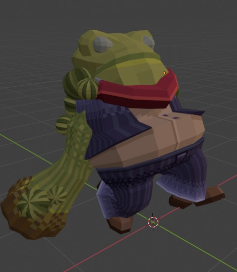

### Enemigo robusto (Espinotauro)
El enemigo robusto es un tipo de enemigo con mucha resistencia a los golpes, contando de 7 puntos de vida. Cuando usas el gancho con este enemigo solo puedes ir hacia él, en el caso que quieras atraerlo hacia a ti el gancho volverá solo. Cuando está a cierta distancia del jugador el enemigo lanzará piedras hacia su dirección, que causarán aturdimiento y uno de daño si no se esquiva. En ocasiones podrá lanzar a los enemigos suicidas. Cuando el jugador está cerca o lo tiene enfocado realizará ataques más lentos de lo normal, pero hacen 2 de daño. Cuando realiza los ataques tiene un "super armor" que no vuelve inmune a los ataques del jugador. Este enemigo cuenta con los siguientes patrones de ataque:
 
  1. Ataque central.
  2. Ataque izquierdo y ataque derecho.
  3. Ataque derecho y central.
  4. Ataque derecho.
  5. Ataque izquierdo.

  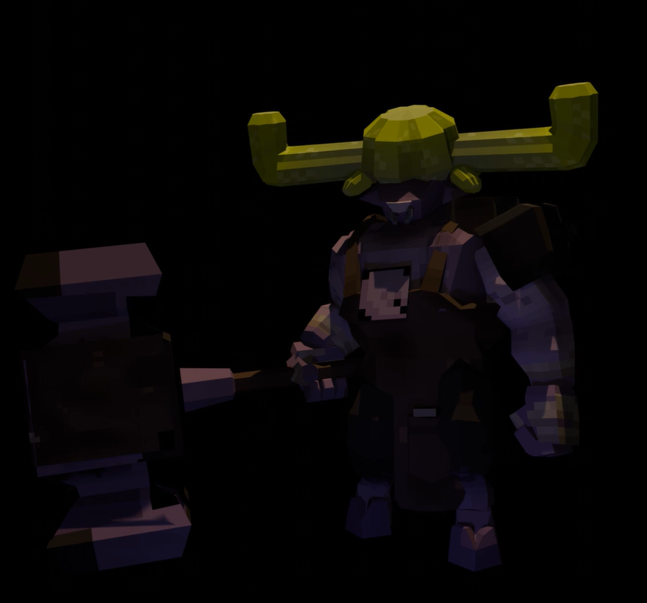

### Francotirador (Buitre Saguaro)
Como su nombre indica este enemigo porta un arma con forma de francotirador, pudiendo detectar al jugador en un rango de 14 metros. Sus disparos tienen un daño de 2 corazones y tarda unos 3 segundo en poder volver a disparar.Para poder disparar se tendrá que cubrir por una cobertura. Este enemigo cuenta con 3 puntos de vida. Cuando el jugador enfoca a este enemigo adopta una postura defensiva cubriéndose por dos lados a la vez. Cuenta con 2 posibles posiciones de defensa:
  1. Defensa izquierda.
  2. Defensa derecha.

Si el jugador golpea en la dirección donde defiende, este contratacará y si le da, huirá a la cobertura más cercana. En caso de que el jugador enfoque a otro enemigo o reciba el ataque de otro por detras este también huirá a la cobertura más cercana.

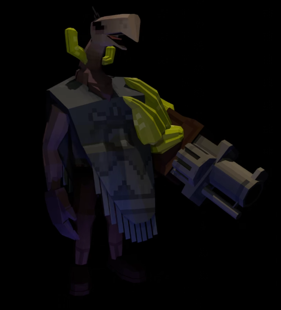

### Jefe final (Lince)
El jefe final es la versión cactuctificada del marido (Lince). Su tamaño es mayor al del protagonista y porta un arma que es una combianción de hacha y rifle. Al tratarse del jefe final cuenta con dos fases diferentes:
  * **Fase 1**: Esta fase cuenta con 12 puntos de vida y se centra solo en ataques melee. Sus ataques son muy rapidos, realizando 1 de daño por lo general. Cuenta con los siguientes patrones de ataque:
    1. Ataque derecha, ataque izquierda y ataque central.
    2. Defensa izquierda y centra, ataque central, defensa derecha y central, y ataque derecha.
    3. Defensa total y ataque total (solo se esquiva para atrás y hace 2 de daño).
    4. Defensa total, ataque derecho y ataque izquierdo.
    5. Defensa derecha y central, ataque izquierdo y ataque derecho.
  
  * **Fase 2**: La fase 2 del jefe todavía está en desarrollo. Se tiene pensado implememtar ataques a distancia e invocar enemigos, además de nuevos ataques melee.

# 4. Arte 

A continuación se hará un resumen del apartado artístico general de Coyote Requiem, desde el arte conceptual, inspiraciones y paletas de color hasta el arte final que se utilice en el juego. Para información más detallada sobre guías de diseño y modelado, procesos de trabajo y especificaciones artísticas, consultar el **documento de estilo**.

## 4.1. Estilo artístico general

Coyote Requiem combina elementos de Western con algunos de Fantasía Oscura y un toque de terror Lovecraftiano. La paleta de colores elegida es por tanto una combinación de estos elementos: paletas tierra, propias del oeste, pero pasando por tonos más fríos del terror cósmico, con un toque extraterrestre para representar a los enemigos como fuerza extraña al entorno natural del desierto donde se ambienta el juego. 

Los enemigos comparten un lenguaje visual único dentro del juego que los diferencia del resto del mundo. En la historia del juego, una fuerza extraterrestre llega al desierto en forma de meteorito, lo que causa una infección de hombres cactus. El lenguaje visual de los enemigos es por tanto el de los cactus en sus diferentes variantes, pero con una paleta de color exclusiva de ellos como grupo. 

Además de en la mezcla de paletas, la combinación del juego de fantasía y realismo se verá reflejada en el diseño de personajes (animales antropomórficos, anatomías de fantasía, elementos mecánicos exagerados) y en el de escenarios (arquitectura fantástica, entornos naturales místicos). 

## 4.2. Personajes

###  Personaje principal

El diseño del protagonista de Coyote Requiem ha pasado por varias iteraciones en su desarrollo. Fue el primer personaje diseñado y, por tanto, fue importante decidir para él unas proporciones y lenguaje visual que definirían a todos los demás personajes del proyecto. 

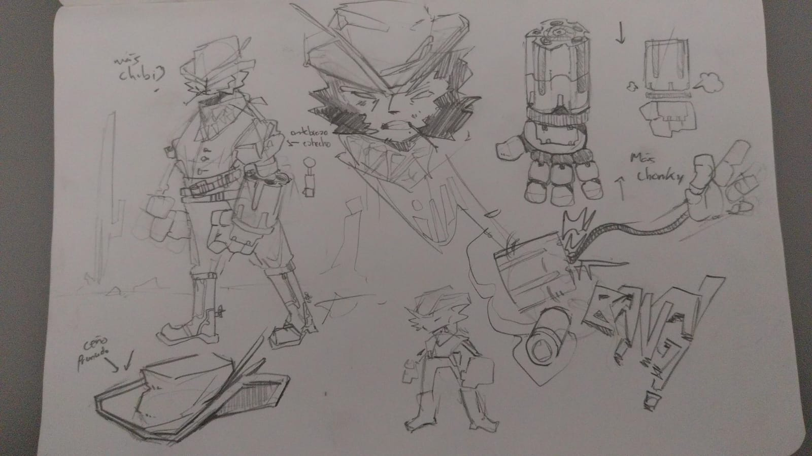

Primer concept art del protagonista. Proyecto de ficha de personaje

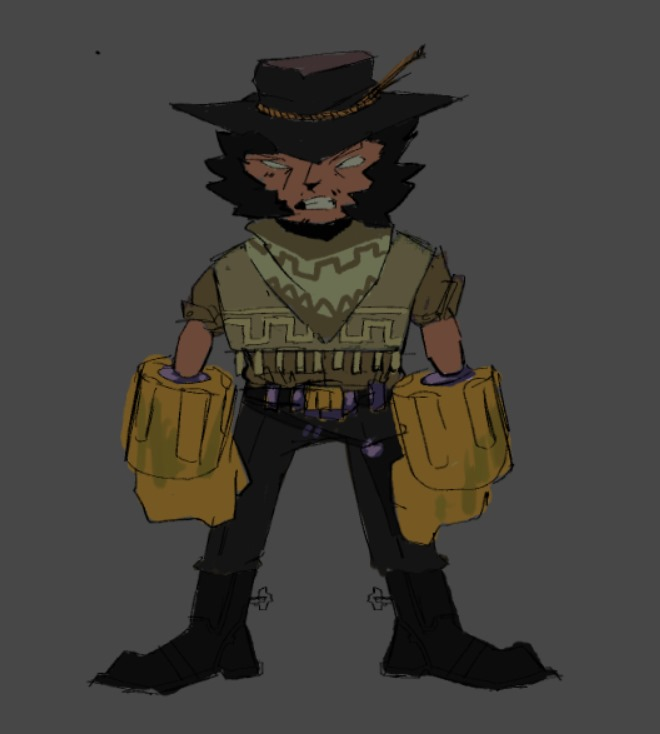

Concept art a color. Diseño no final.

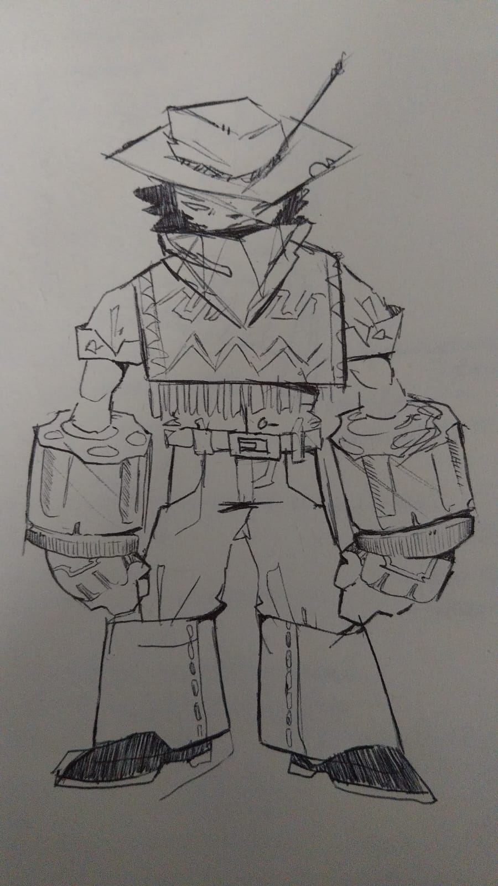

Concept art con el diseño final del personaje

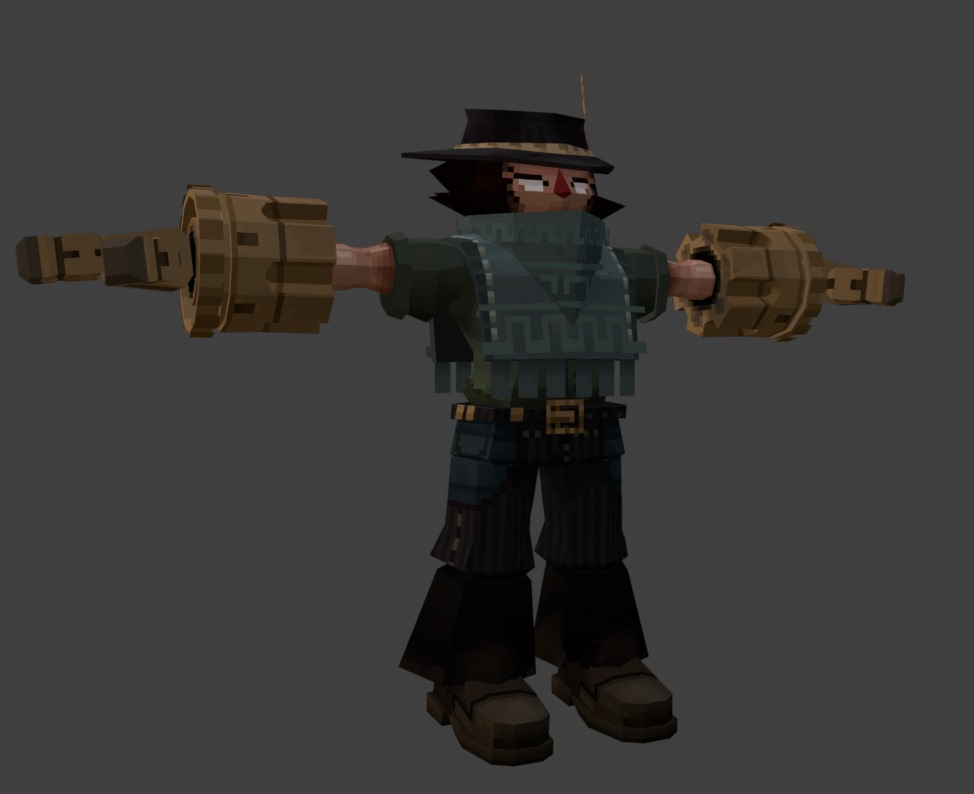

Modelo 3D finalizado del personaje principal

###  Enemigos

#### Bandido Nopal

#### Buitre Saguaro
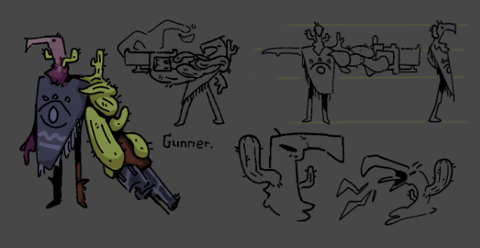

#### Espinotauro
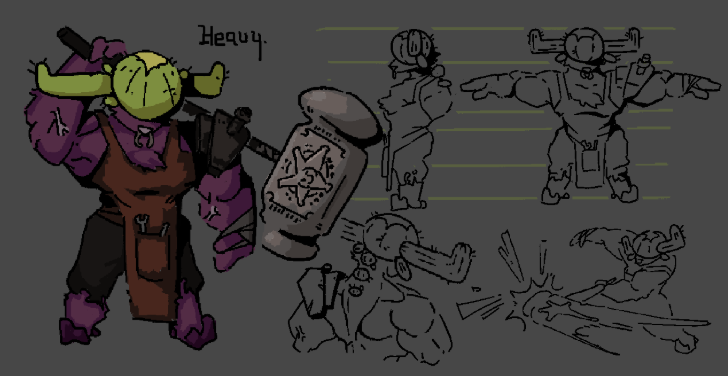

#### Sapo Bombo
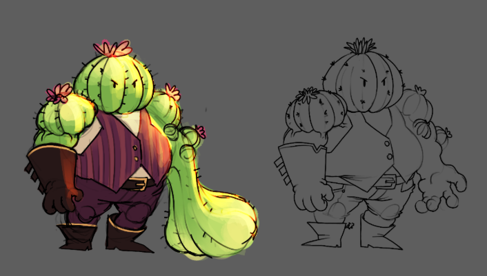

#### Lince
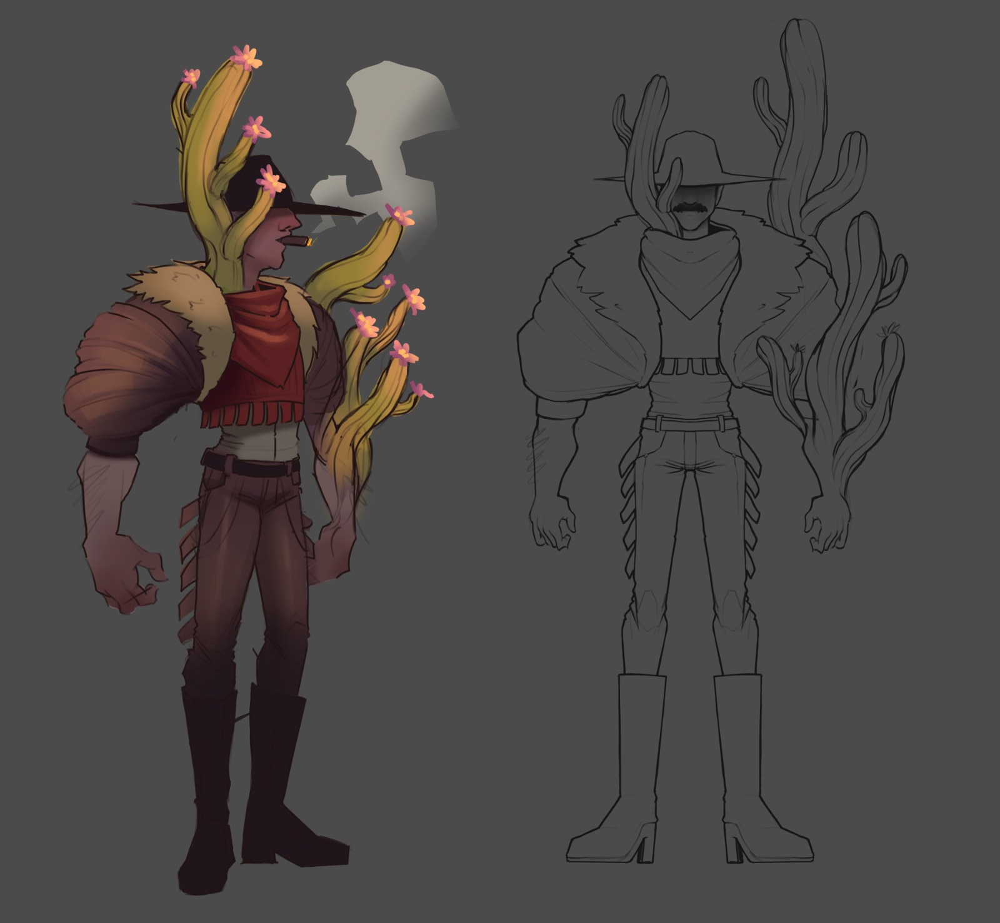

###  NPCs

#### Denébola
Denébola es una habitante de Pricklytown, y es el primer encuentro que tiene Coyote. Ella le avisa de los peligros de la zona y le explica cómo combatirlos en un tutorial.
 
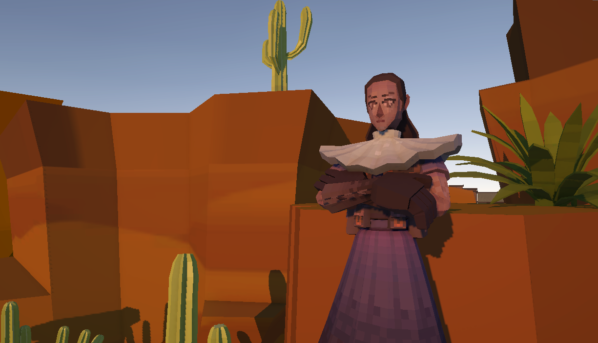
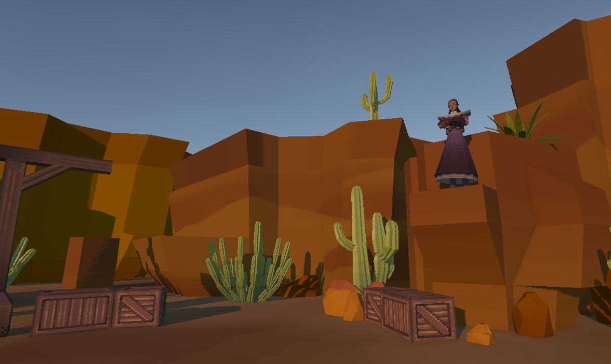
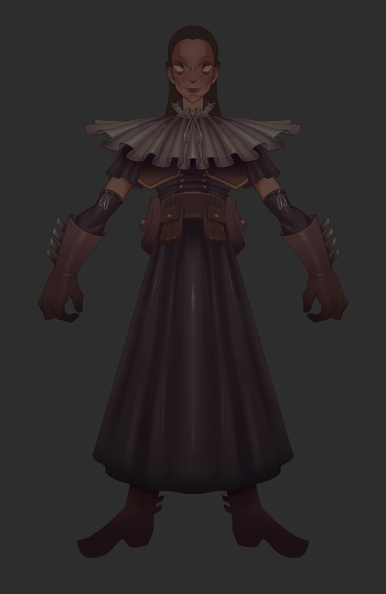
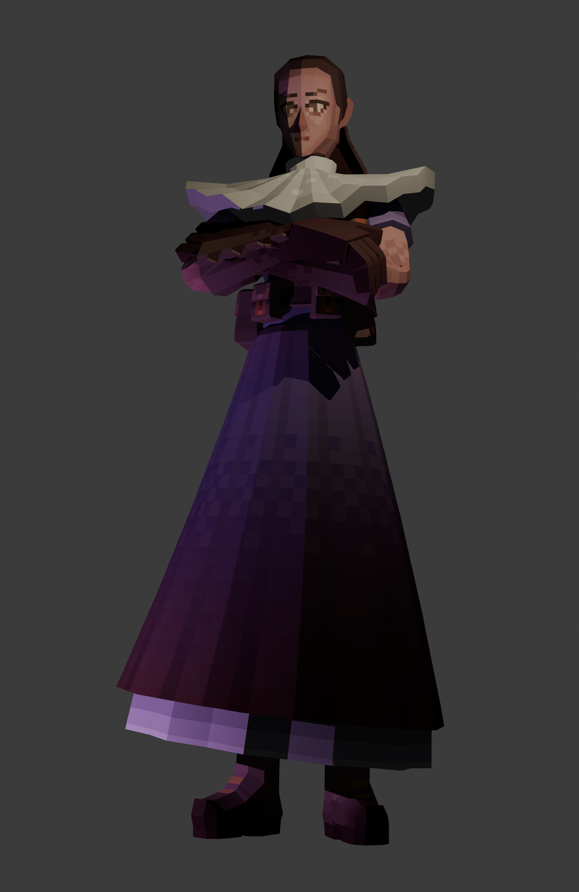

#### El carretero
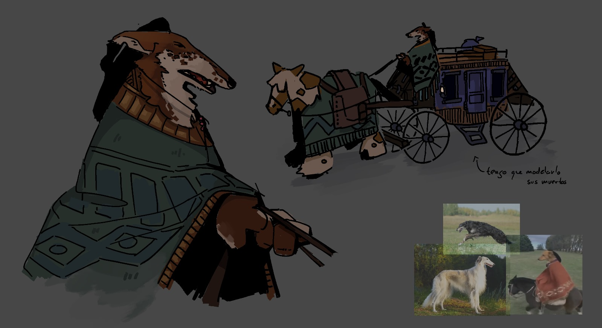

#### Lider secta
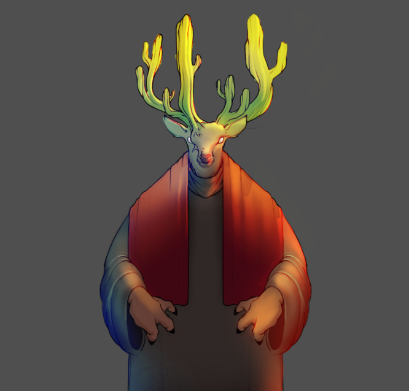

## 4.3. Escenarios

Como se ha mencionado anteriormente, Coyote Requiem cuenta con tres zonas principales,cada una de estas zonas será un único nivel por lo tanto, el juego contará con tres niveles bien diferenciados. Para la introducción y la transición de niveles se meterán cinemáticas simulando ser un comic.

### Pueblo

Este es el mapa del primer nivel del juego que se desarrolla en el pueblo de Pricklytown. El nivel esta dividido en 5 subáreas de combate donde también podrá encontrarse con distintos Npcs que le pondrá en contexto sobre que son esos seres con forma de cactus.
### Cañón

El segundo nivel se sitúa en un oásis. En el mapa se puede observar que es un nivel alargado y dividido en 4 subáreas de combate.
### Oasis

El último nivel se desarrolla en el oasis donde se encuentra tanto el huevo cosmico como la iglesia de la secta. Este nivel es más corto de los demás dividiendolo en 3 áreas de combate. Las 2 primeras son áreas que se dividen en 2 oleadas y la última zona es donde se desarrolla la batalla contra el jefe final.

###  Enemigos
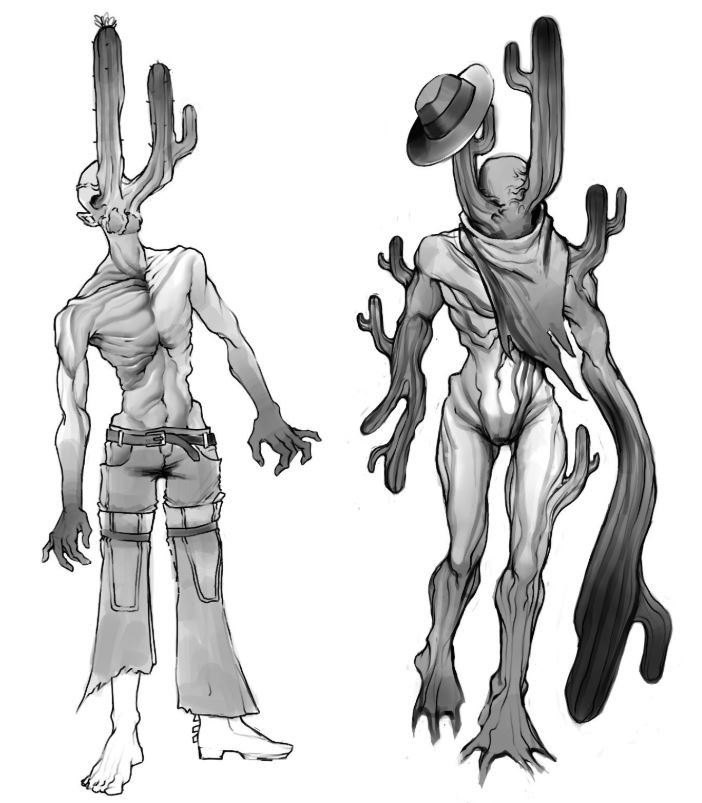
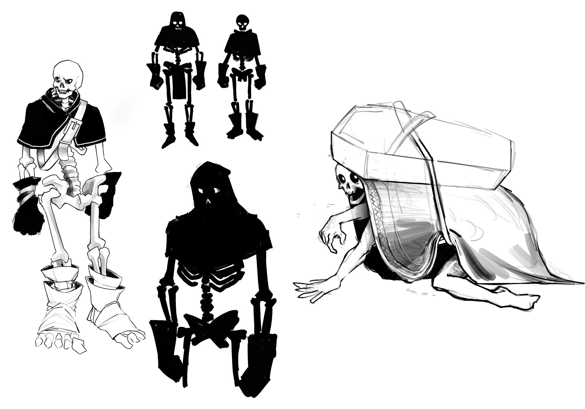

Arte conceptual inicial de algunos enemigos

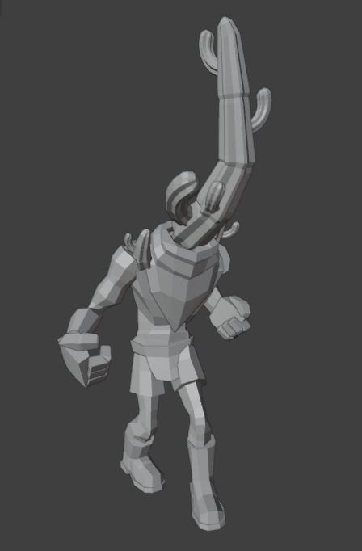
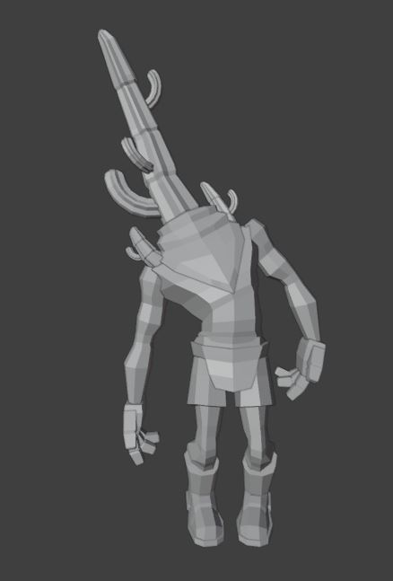
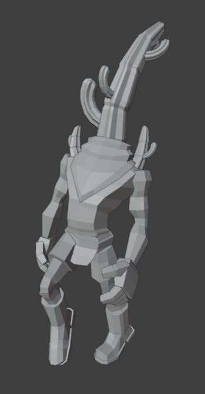

Modelado de el Zombi Nopal

## 4.4. Arte 2D - Interfaces
Diseño inicial de interfaces - vida e indicador de direcciones de ataque o bloqueo.

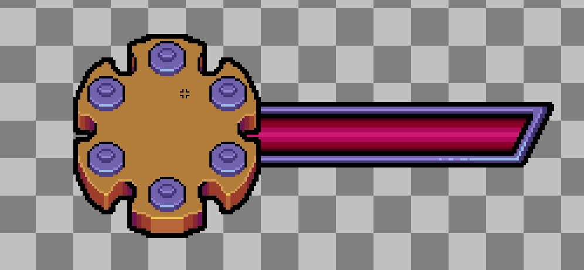
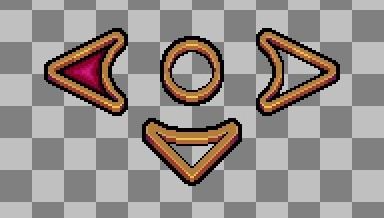

# 5. Sonido y música 
## 5.1. Instrumentación
Para un videojuego ambientado en un lejano oeste con toques de fantasía, se han empleado instrumentos característicos del spaghetti western combinados con sección orquestal. 

En los niveles 1 y 2, se combina la música ambiental y de combate haciendo transiciones suaves entre estas pistas, de manera que cuando el jugador entra en un combate suena la canción de “pelea”, y en los momentos de descanso la “ambiental”. 

### Música ambiental 

Para la música ambiental (o la que suena “normalmente”), se usan los instrumentos típicos de un western: 

* Para las melodías, los instrumentos protagonistas son la flauta/armónica, la trompeta o el banjo. 

* En el cuerpo armónico, se han usado principalmente el bajo acústico y las guitarras clásicas. 

* La percusión en las pistas ambientales es muy moderada y suave, siendo en su mayoría solo timbales o maracas/castañuelas. 

### Música de combate 

Para las batallas, se hace más uso de los instrumentos propios de una orquesta, como se ha comentado anteriormente. Estos son los vientos-madera, los vientos-metales y las cuerdas (violines, violas, violonchelos y contrabajos). 

* Las melodías son llevadas por instrumentos como la trompeta o el violín. 

* El cuerpo armónico está compuesto por los demás vientos-metales, el resto de las cuerdas y los vientos-madera. También se usa un coro compuesto por soprano, alto, tenores y barítonos. 

* La percusión aumenta considerablemente con instrumentos como timbales, tambores de marcha, bombos, platillos… Se añaden campanas tubulares. Aquí la percusión cobra mucha más importancia. 

Son en estas secciones donde suenan los leitmotivs de los personajes.

## 5.2. Leitmotivs 
Todos los leitmotivs están tocados por instrumentos de viento-metal, para darle más importancia a la instrumentación western. 

### Tema de los villanos 
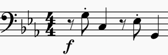

*Leitmotiv de los villanos* 

El tema de los villanos es tocado por los instrumentos metales (trompas o trompeta). Se trata de una escala descendente, que representa al mal. 

 

### Tema del héroe 

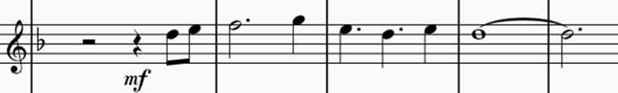

*Leitmotiv del héroe* 

El tema del héroe es tocado por una trompeta solista y, al igual que el tema de los villanos, se repite a lo largo de las canciones de combate, contraponiendo ambos motivos como si del propio combate se tratara. Tiene una ligera subida ascendente a modo heroico. 

 

### Tema del marido 

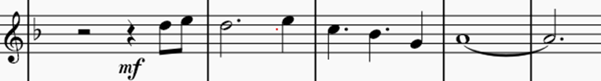

*Leitmotiv del marido* 

Este tema es idéntico al del héroe, pero realizando la segunda voz. Representa la unión con su marido.
## 5.3. Soundtrack
### Tema Menú
Este es el tema que suena al iniciar el juego, en el menú principal.
Está en la tonalidad de Re menor, en un compás de 4/4.
Tiene una percusión de tambores, maracas, castañuelas y bombo. El ritmo lo marcan el tambor y los bajos acústicos, principalmente.
La melodía la llevan una guitarra eléctrica y un banjo, con ciertos detalles de flautas de pan y armónicas o coros masculinos

#### Tema Tutorial
Se trata de un tema desenfadado y divertido, donde el protagonista se enfrenta a un cactus a modo de tutorial. Está en tono de Mi menor, variando a La menor (su 5ª) cada 8 compases, y un compás de 4/4. Tiene cierto aire circense.
Se emplea como base un piano y dos bajos (acústico y eléctrico). La melodía la llevan en un principio una guitarra eléctrica y un banjo, para luego ser protagonistas una flauta de pan y una trompeta en la siguiente sección.
Se mantiene un ritmo alegre y bailable durante toda la canción.

#### Tema Pueblo
Su compás es 4/4.
##### Base
Es un tema aventurero, que transmite calma al principio, pero va adquiriendo fuerza e intensidad. Su instrumentación es puramente de vientos-madera.
La melodía es tocada por flauta y oboe. Mientras que los clarinetes marcan el ritmo y el clarinete bajo y fagot llevan la armonía.
La única percusión son los timbales.

##### Combate
Para dar un toque más marcial, se añaden los demás instrumentos de percusión (tambor, bombo, platillos) y los vientos-metales (trompas, trompeta, bombardino y tuba). Estos instrumentos añadidos le dan más cuerpo y consistencia a la canción, haciéndola más épica y adecuada al combate.
En un pequeño fragmento sección A de la canción, las trompas realizan el tema de los villanos, con un sonido oscuro. Mientras que al final de la sección B, la trompeta toca el motivo del héroe, con un timbre mucho más claro y limpio.
Al final de la canción suenan campanas en referencia a la iglesia del pueblo.

#### Tema Cañón
El segundo nivel del videojuego se desarrolla en un cañón. Para este entorno, nuevamente hay una canción base y una canción de combate, que añade instrumentos y voces sobre la base. Está en el tono de La menor, y su compás es 12/8, para dar una sensación de dinamismo.
##### Base
La armonía de la canción la lleva la sección de cuerdas frotadas: los violines y violas realizan notas cortas y picadas, mientras que los violonchelos y contrabajos realizan una cadencia andaluza (LAm-SOL-FA-MI) con notas más alargadas para llenar el espacio.
La armónica realiza la voz solista, y una guitarra eléctrica haciendo la cadencia andaluza con acordes y algunos arreglos.
Por último, se realiza un crescendo y la canción “rompe”, añadiendo una melodía solista de violín mientras se repite toda la estructura anterior.
La percusión es simple: unos timbales redoblan y rompen en platillos cuando hay una subida.

##### Combate
La voz solista inicial de la armónica es reemplazada por una trompeta, con un cuerpo armónico de bombardino y tuba. Las trompas realizan el leitmotiv de los villanos. En el crescendo, se incorporan las voces de un coro (soprano, alto, tenor y barítono).
Cuando rompe la canción (aquí sí rompe, realmente), se incorpora la armónica de la canción base, acompañada por la trompeta. Suena también una campana tubular en La.
Las trompas realizan primero el leitmotiv del héroe y después el del villano (simulando el enfrentamiento entre estas dos partes). El tema del villano está más acentuado que el del héroe, dando a entender que el enemigo aún sigue suelto y el héroe no ha vencido aún.
En esta canción de combate sí hay percusión. Unos tambores militares marcan el ritmo de la marcha, junto con el bombo.

#### Tema Oasis
##### Base
Aún por definir.

##### Combate
Aún por definir.

##### Boss Final
Este es el tema que suena al enfrentarte al jefe final. Es el más complejo de todos y hace uso de todos los instrumentos mencionados anteriormente, añadiendo algunos nuevos. Su compás es 4/4.

###### Sección A
En esta escena, nuestro protagonista reposa las cenizas de su difunto marido sobre el meteorito con la intención de devolverle a la vida. Es por eso por lo que el tema empieza con una introducción emotiva, usando una orquesta con secciones de cuerdas y vientos madera.
La voz solista la llevan la armónica y los violines primeros, y una guitarra haciendo un trémolo. Simbolizan la esperanza y desesperación de volver a reencontrarse con él. La guitarra (que representa la esperanza) se acaba apagando, mientras la armónica (desesperación) y el resto de la orquesta aumentan y bajan su intensidad, a medida que nuestro personaje va notando que algo no marcha bien.
Por último, esta sección acaba con dos toques de campana tubular en DO (representa al protagonista y al marido), dando un toque más místico al ambiente e introduciendo la siguiente sección.

###### Sección B
Aquí el tema rompe por completo y el personaje entabla combate contra su adversario. Se acelera el tempo. El violín 1º y el fagot tocan el motivo dramático de esta sección, acompañados por el clarinete bajo que realiza una segunda voz.
Entran voces de coro haciendo ritmos sincopados, pero desplazando el acento de la métrica y dando una sensación de inestabilidad, al igual que los timbales. Los violines segundos, violas y violonchelos realizan una cadencia en semicorcheas para dar agitación al tema.
Los vientos metales tienen la base armónica de esta sección. Aquí la trompeta introduce sutilmente el leitmotif de los villanos, dando a entender que a quien te enfrentas ya no es tu marido. El tema se modula en sus dos últimos compases, con un redoble de timbales, para dar paso a la siguiente sección.

###### Sección C
En esta sección la canción se torna más western, con una base de percusión que simula a un caballo galopando con el protagonismo de los tambores.
Aquí se suprime la sección de cuerda y vientos-madera; y los vientos-metales toman más importancia. Se mantiene el coro realizando acordes sincopados, pero inestables; y entra un bajo acústico.
El primer tema de esta sección lo realiza la guitarra eléctrica, para luego ser reemplazada por la trompeta. Esta realiza una función muy importante, ya que hace sonar el leitmotiv del héroe y del marido al unísono, dando a entender esa unión tan especial que tenían, pero a la vez el enfrentamiento que están teniendo.

*Leitmotiv del protagonista y marido*

#### Créditos
El tema de créditos tiene un compás 4/4.

La percusión consiste en castañuelas y maracas, haciendo ritmos sincopados.

La armonía de la canción la lleva un bajo acústico, dando la tónica, y un banjo, arpegiando los acordes. 

Las melodías las interpretan una flauta y una armónica.

Se trata de un tema sosegado que es acorde con el momento emocional del final del juego.

# 6. Menús e Interfaces 
## 6.1. Diagramas de flujo 

### Menú inicio
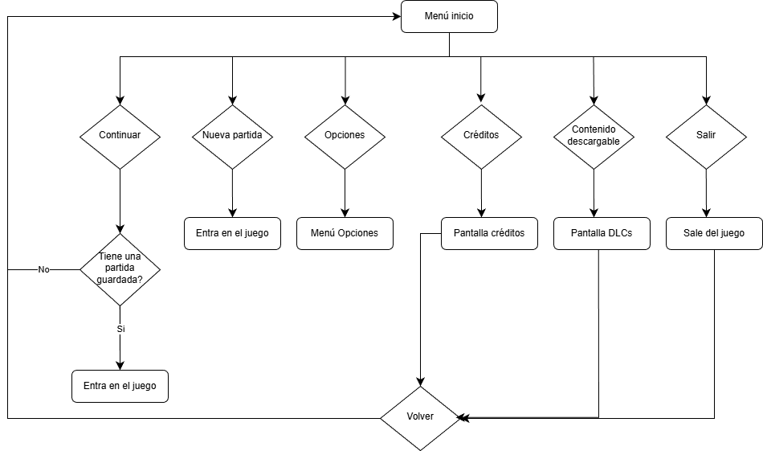

### Menú opciones

### In game

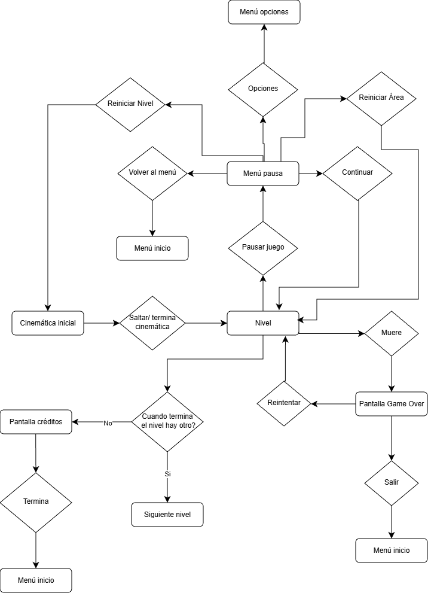

### Requisitos funcionales
__Menú inicio:__ El menú de inicio es lo primero que se encuentra el jugador cuando inicia el juego. En este menú se pueden observar los siguientes botones:
 
* __Nueva partida:__ El jugador comienza el juego desde 0.

* __Continuar:__ El jugador continua la partida desde el punto donde lo había dejado en caso de tener una partida guardada, si no la tiene no pasará nada.

 * __Opciones:__ El jugador accederá al menú de opciones donde podrá ajustar los niveles de audio general, música y efectos sonoros.

 * __Créditos:__  El jugador accede a la pantalla de créditos donde aparecerá los miembros que conforman el equipo y su trabajo realizado.

 * __Contenido descargable:__ El jugador puede acceder a una pantalla donde se mostrará el contenido descargable que dispone/dispondrá el juego.

 * __Salir:__  Con este botón el jugador saldrá del juego.

__In game:__ Para acceder al menú de pausa es tendrá que pulsar la tecla "esc" en ordenador o el respectivo botón en dispositivos móviles.

 * __Menú pausa:__ En este menú se presentan tres opciones al jugador:
   
    1. __Salir:__ permite al jugador volver al menú inicial.
       
    2. __Reintentar:__ resetea el nivel volviendo a iniciar desde la cinemática.
       
    3. __Reanudar:__ vuelve al nivel en el momento que lo pausó.

    4. __Opciones:__ te lleva al menú de opciones.

 * __Muere:__ Cuando el personaje muere se presenta ante él una pantalla de Game Over con dos opciones:
   
    1. __Reintentar:__ vuelve al último Check point.
       
    2. __Salir:__ vuelve al menú inicial.
       
 * __Termina el nivel:__ Al completar el nivel se presentan dos situaciones. Si hay otro nivel después se pasará al siguiente, pero si ya ha terminado el juego irá a la pantalla de créditos y luego al menú inicio cuando acabe.

 ## 6.2. Diseño de interfaces
 ### Interfaces combate
 ### Menú principal
 ### Menú opciones
 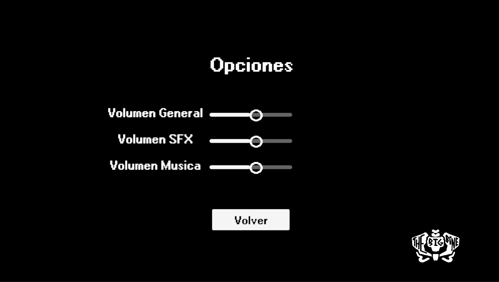

 ### Menú pausa
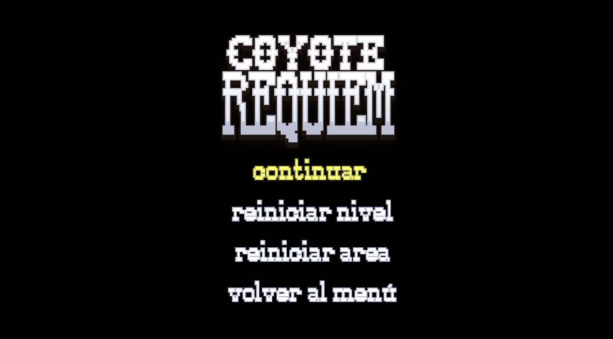

 ### Pantalla Créditos
 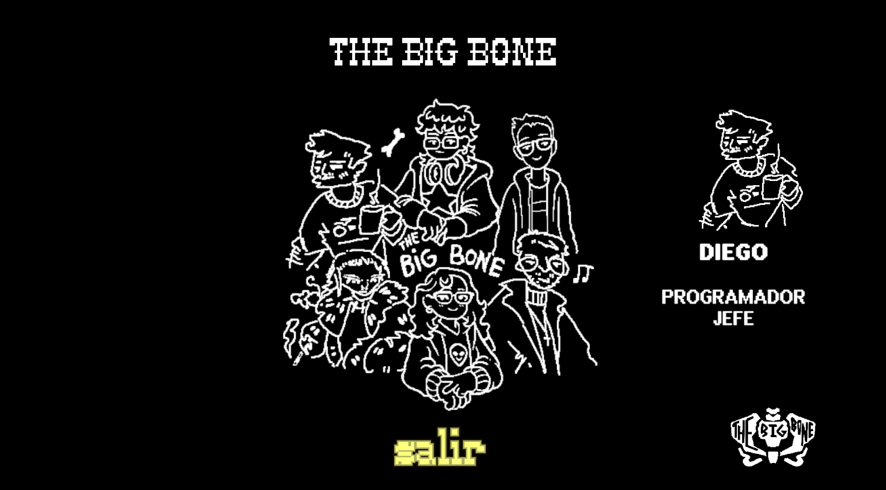

 ### Pantalla DLCs
 ### Pantalla muerte
 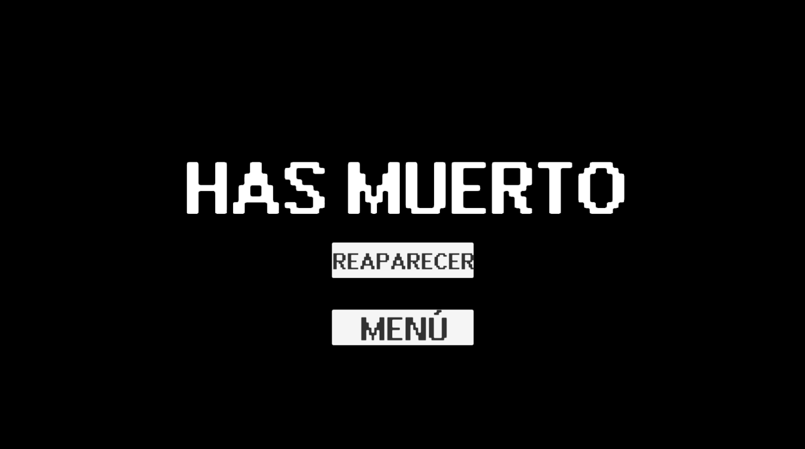

# 7. Modelo de Negocio y Monetización

## 7.1. Monetización

Al tratarse de un videojuego de acción frenética en tercera persona, el tipo de monetización que más encaja con nuestro tipo de juego es ***Buy to Play***, pues es lo normal en juegos de este estilo donde los jugadores realizan un pago único para disfrutar de la experiencia completa.

Por el momento se tiene plateados 2 DLCs  pequeños para aquellos jugadores que más les haya gustado el videojuego: libro de arte y banda sonora, ambos en formato digital. Estos DLCs, aunque no amplifican la experiencia de juego, permite a los jugadores tener en su poder el arte del juego y el soundtrack del mismo para disfrutarlo en cualquier momento, cosa que suelen hacer juegos de escala menor como el nuestro para sacar un beneficio extra.

Aparte de los 2 DLCs pequeños, se tiene planteado hacer uno más grande llamado "Episodio Extra" que funcionará como precuela donde controlaras a Lince descubriendo quien es realmente, cual es su relación con Coyote y que fue lo que le sucedió en realidad. Este episodio extra contará con un nivel nuevo situado en las gélidas montañas de Hell Mountain, con nuevos enemigos y mecánicas.

PRODUCTO              |  PRECIO
--                    |  --     
Juego base  |   10 €
DLC: libro de arte |   3 €
DLC: Banda sonora | 3 €
DLC: Episodio Extra | 5 €

## 7.2. Planificación y Costes
### El equipo humano
  * __Antonio__:	Diseñador de sonido y programador.
  * __Diego__:	Programador.
  * __Candela__:	Artista 2D, artista 3D y animadora 3D.
  * __Edu__:		Artista 2D, artista 3D, animador 3D y artista técnico.
  * __Andrea__:	Programadora.
  * __David__:	Game designer y guionista.

### Estimación temporal del desarrollo

La realización del proyecto tendrá un tiempo límite de 13 semanas teniendo en cuenta una subdivisión en distintas etapas:

  *	Versión Alpha (semana 5): Para esta versión del juego se tendrá programada una versión simple del combate, donde habrá un jugador y un enemigo que entra en combate. Esta versión contará con un tutorial para que se entienda bien las mecánicas principales.

  * Versión Beta (semana 9): Para esta versión se tendrán montados los niveles, enemigos y programado y mejorado mecánicas como el gancho, el combate o la cámara. Se intentará tener texturizado la gran mayoría de los elementos del juego, igual que un sistema de interfaces y menús funcionales e intuitivos.

  * Versión Release (semana 13): Esta es la versión final del juego. Aquí se mostrará el juego terminado habiendo pasado por un testeo, corrección de errores y terminado de añadir detalles menores del mismo.

Durante estas versiones cada semana se pondrán metas a alcanzar para el final de esta.

# 8. Marketing y Redes Sociales

Para publicitar el juego se han creado distintas redes sociales como Instagram, Youtube, X, ... El uso de estas redes sociales serán para presentar los distintos integrantes del equipo y los pequeños avances que se hagan conforme avanza el tiempo.

El público objetivo de este proyecto son personas adolescentes mayores de 16 años con interés y algo de experiencia en videojuegos de combate frenético en tercera persona, que sientan atracción por los mundos de fantasía, el viejo oeste o por la estética lovecraftiana, por lo que habrá que enfocar el marketing hacia dicho público.

# 9. Post Mortem

## 9.1. Post Mortem - Alfa

### Eduardo Almarza Blasco

#### Lecciones aprendidas

La necesidad de estructurar las tareas del proyecto desde el minuto uno, evitando dependencias y esperas y, sobre todo, asumiendo fechas que permitan una cierta holgura en caso de que las cosas se retrasen. Necesitamos reducir el scope ligeramente, pero sobre todo crear un "roadmap" concreto donde nos establezcamos en qué fechas deben estar hechas cada una de las tareas. Comunicarnos para estar todos en una misma página antes de empezar a trabajar es crucial para no hacer trabajo innecesario o duplicado.

Por ejemplo, cuando los artistas del proyecto empezamos a desarrollar concept art, personalmente salté demasiado pronto al diseño del protagonista. Esto complicó adaptarlo a las siguientes iteraciones de la idea y del trabajo, cosa que hubiese sido más sencilla si me hubiera esperado a tener la idea del juego más madura.

#### Trabajo individual realizado

Por mi parte, mi principal tarea ha sido realizar el diseño, arte conceptual, modelo 3D, texturizado rigging y animación del personaje principal, tanto en Blender como en la integración al motor, habiendo programado el animator controller del mismo.

También he realizado trabajos menores en el apartado visual del Alpha, como el Shader del personaje (que se utilizará después para todos los personajes), la UI, la integración de las animaciones en el motor y ligeros efectos de fedback.

Finalmente, y ya fuera de lo que es el juego, he realizado el logo del grupo y he comenzado a definir lo que será la estética de nuestras redes sociales (fuentes, estilos, paletas de color...).

#### Trabajo colectivo realizado

He trabajado de manera continua con Candela en el planteamiento y desarrollo de todo el apartado artístico. Desde las primeras reuniones de proyecto, hemos decidido entre los dos el estilo visual, los detalles de la ambientación y las especificaciones concretas de los modelos. Además nos hemos encargado de definir un *workflow* común para trabajar los personajes y su importación desde Blender.

También me he mantenido en contacto con los programadores para comprender sus sistemas y poder modificarlos si fuese necesario en mi labor de artista técnico. Como ya he mencionado me he encargado de modificar su código para, por ejemplo, añadir efectos de animación o componer los animator controllers.

Además he tenido un papel significativo en la toma de decisiones sobre diseño, ambientación y, en general, sobre la idea del juego en las primeras reuiniones

### Antonio Bernal de Celis
#### Lecciones aprendidas

La importancia de trabajar en equipo, de tener unos propósitos marcados claramente desde el primer momento y fijar unas fechas para cumplir estos objetivos. También he aprendido la importancia de no tener miedo de recurrir a compañeros por ayuda.

#### Trabajo individual realizado

Mi trabajo individual ha sido la creación de un sistema de movimiento para el personaje controlable. En este sistema, el personaje es capaz de andar, correr y realizar un dash como movimientos básicos. También se le ha aplicado gravedad al personaje y se ha empezado el sistema de gancho para poder atraer/acercarse a enemigos.

He implementado el input system para que controlar las entradas del jugador y configurar los controles en función del dispositivo con el que se esté jugando (teclado, móvil o mando). Se ha empezado a configurar los controles del mando.

#### Trabajo colectivo realizado

He mantenido contacto sobre todo con el equipo de programación (Andrea, Diego y yo). Nos hemos comunicado las actualizaciones de cada uno. Mientras yo programaba el movimiento, Andrea hacía la cámara y estábamos en constante contacto.

Además, todo el trabajo de programación ha pasado por la supervisión de Diego y también he estado en contacto con él como asesor.

### David del Castillo Enríquez
#### Lecciones aprendidas

En cuanto a las lecciones aprendidas me he dado cuenta de que es muy importante tener una visión clara del proyecto desde el principio, pues en distintos momentos de esta versión nos hemos dado cuenta de que teníamos visiones algo distintas tanto en el planteamiento de ciertos aspectos del gameplay como identidad del juego

#### Trabajo individual realizado

Mi trabajo individual realizado ha sido principalmente crear el linktree y la mayoría de las redes sociales, pensar en los escenarios que tendrá el juego, los distintos enemigos y comportamientos de estos, aclarar y rellenar apartados de la jugabilidad dentro del GDD para que todos los miembros estén de acuerdo, los diagramas de flujo junto a su explicación, la implementación de un boceto de idea del menú principal y la creación básica del menú de juego.

En este trabajo la verdad que he sentido libertad a lo que respecta a mi apartado como game designer obviamente planteando de antemano ciertas ideas y conceptos a mis compañeros para saber su opinión.

Es verdad que tengo la sensación de que podría haber avanzado más o planteado cosas más pronto en cuanto a mi trabajo dentro del grupo. 

#### Trabajo colectivo realizado

Mi trabajo colectivo con otros miembros del equipo ha sido con Candela a la hora de plantear la historia y rellenar lo esencial para el GDD.
La comunicación con mi compañera a la hora de plantear los puntos principales de la historia y el Wordbuilding ha sido muy buena.

En general yo planteaba los conceptos o ideas en el GDD con un desarrollo y ella los revisaba y corregía reescribiéndolo para darme cuenta de la visión general y no alejarme de ella, además de darle un toque más narrativo.

También cabe resaltar que la idea de que el prota tenga que enterrar las cenizas de su marido fue una idea general del grupo al igual que la ambientación. 

### Diego Fernández Manso

#### Lecciones aprendidas
  Principalmente se ha aprendido sobre división de trabajo de cara a programación. Eramos un grupo de tres centrados en programación y hemos tenido que dividir un proyecto relativamente grande.
  En relacion al propio desarrollo, se ha aprendido mucho sobre inteligencia artifiical y comprotmaiento de personajes ya que se ha utilizado el API de arboles de comportamiento de personajes.

#### Trabajo individual realizado
  El trabajo individual se ha centrado en mayor parte con el sistema de combate y el comportamiento de los enemigos.
  El mayor pro es que al ser una parte relativamente aislada del resto del proyecto se ha podido trabajar sin muchos conflictos con el trabajo del resto del equipo. Con la excepción de sistemas como los controles que por suerte estaban pensados desde el principio para una buena integración con el sistema de combate.
  En lo negativo, al ser muchos sistemas entrelazados (IA, combate, vida, llamadas a animators) ha habido muchos días donde el trabajo daba pocos o ningun resultado. 
  Ademas se han tenido que rehacer varias veces los sistemas ya que se habían diseñado sin tener en cuenta todas las necesidades de diseño.

#### Trabajo colectivo realizado
  El mayor problema colectivo a nivel de programación es que algunas tareas no se han dividido muy bien, lo que ha llevado a cierta solapación en los sistemas a realizar, lo que ha significado trabajo perdido.
  En el lado positivo, una vez se corrigieron estos problemas iniciales hemos podido sincronizarnos bien y, debido a que tenemos experiencia previa con github, hemos podido evitar conflictos de archivos y branches.

### Candela Jiménez González
#### Lecciones aprendidas
  La entrega de la versión alfa ha sido clave para considerar de forma más realista el scope del proyecto completo. Ver hasta dónde hemos llegado como equipo en esta primera entrega nos ha permitido entender que el primer planteamiento del proyecto se nos iba un poco de las manos y que iba a ser necesario el uso de herramientas de gestión y la división de tareas en subtareas con fechas de realización. Ha habido varios objetivos que planteamos al principio a los que no se han podido llegar por esta falta deorganización. 

#### Trabajo individual realizado
  Mi trabajo principal en esta entrega ha consistido en el diseño, modelado y animación del enemigo base, creando sus animaciones de ataque, de bloqueo y de caminar. 

  Además, me he encargado de realizar concept art (tandto de enemigos como de personajes no jugables) a partir del trasfondo del juego que hemos ido construyendo. He participado mucho también precisamente en el desarrollo de esta historia y en el worlbuilding general. 

  También he sido la encargada de la estructuración y la escritura de gran parte del Readme, así como de la creación de algunos de los recursos visuales de este.

  Finalmente, también he empezado con el diseño y planteamiento inicial de la página web.
  
#### Trabajo colectivo realizado
  He trabajado en todo el desarrollo de esta entrega con Edu, sobre todo cuadrando el estilo visual general y tomando decisiones las de diseño que más nos cuadrasen conjuntamente para el proyecto. Nos hemos encargado de precisar el concepto de personajes y escenarios para que, ya que ambos vamos a trabajar en arte, partamos de un punto común y tener clara la estética y la sensación que queremos darle al juego. Esto ha sido fácil gracias a la creación de un documento de estilo y gracias a nuestra continua comunicación durante el desarrollo de assets.
  
  También he colaborado conjuntamente con Diego y Edu a la hora de integrar las animaciones en el motor de desarrollo e incluirlas en el controlador. 

### Andrea Luengo Zazo
#### Lecciones aprendidas
  En el ámbito teórico se ha aprendido sobre monetización y gestión de proyectos. Por otro lado, en el desarrollo del proyecto se ha ampliado en gran cantidad el conocimiento relacionado con *cinemachine* y cámaras virtuales, en concreto de *state-driven camera* para cambiar de una cámara a otra a través de un *Animator*. También se ha aprendido a localizar enemigos en un rango concreto y se ha aumentado la comprensión del espacio 3D en Unity.
#### Trabajo individual realizado
  El trabajo individual realizado a lo largo de la primera fase del proyecto se ha centrado sobre todo en el desarrollo del sistema de cámaras, la transición entre los diferentes modos(Lock y libre) y la detección de los enemigos en un rango concreto.
#### Trabajo colectivo realizado
  Gestión y reparto de tareas.

## 9.2. Post Mortem - Beta

### Eduardo Almarza Blasco
#### Lecciones aprendidas
Siendo este el proyecto más ambicioso en el que he trabajado, me he enfrentado a muchos retos nuevos, especialmente en cuanto al trabajo en 3D y arte técnico. Han aparecido múltiples retos que implican ir un poco más allá que modelar, hacer uvs y texturizar (que es lo que había hecho hasta ahora). Además he tenido que animar muchísimo, lo que me ha hecho practicar una barbaridad sobre animación

#### Trabajo individual realizado
Mi trabajo principal ha sido el de animar en 3D los enemigos, así como desarrollarlos desde 0 (incluido el concept art). Además de eso he modelado y texturizado todos los escenarios del juego, utilizando técnicas de texturizado procedural y bakeo en blender.

#### Trabajo colectivo realizado
He colaborado con Candela en la realización de arte, pero nuestras tareas no se han solapado apenas. La persona con la que he tenido que coordinarme más ha sido David, quien ha sido encargado de montar la lógica de los enemigos y escenarios, por lo que mi trabajo ha dependido un poco de sus demandas.

### Antonio Bernal de Celis
#### Lecciones aprendidas
Este proyecto me está ayudando a descubrir nuevas técnicas, tanto de programación como especialmente a nivel de ingeniería de sonido. También me está permitiendo salir de mi zona de confort al componer. Se está buscando mezclar un mundo western con toques de fantasía, y las composiciones tienen referencias indirectamente a otros sectores musicales ajenos a los videojuegos, como el flamenco o la música relativa a la Semana Santa, haciendo que de esta banda sonora algo único. También se han creado leitmotifs para los personajes.

#### Trabajo individual realizado
Principalmente, mi trabajo ha sido componer la banda sonora del videojuego en su totalidad, haciendo una música dinámica que alterne entre la tranquilidad del personaje caminando por el mundo y la música de combate que suena al enfrentarte a enemigos. Este dinamismo se consigue componiendo ambas tracks (base y combate) y alternándolas mediante el sistema de sonido del juego.

Sistema de movimiento del jugador: andar, correr, dash, gravedad, deslizamiento en el suelo, movimiento en rampas...

Efectos de sonido: se han añadido SFX de terceros, mediante AnimationEvents (golpes en el aire, pasos, muelles...) y SFX de puñetazos, parrys, bloqueos...

#### Trabajo colectivo realizado
Aporte sobre el diseño de la IA de enemigos. Aunque el trabajo de IA haya sido primordialmente y en su mayoría, parte de Diego, se ha trabajado en conjunto sobre el diseño de los enemigos y su comportamiento.
También he colaborado con Candela en la realización de las publicaciones de redes sociales.

### David del Castillo Enríquez
#### Lecciones aprendidas
  Durante esta etapa del proyecto he aprendido la importancia de la comunicación entre las distintas secciones que conforman el proyecto y el trabajo en equipo que es necesario para llevar adelante un proyecto como es el realizado.

#### Trabajo individual realizado
  Durante esta etapa del proyecto he realizado el diseño de los niveles, montado y dividido de las escenas, colocando los props, enemigos y las zonas de combate. También me he dedicado a montar los animators de los enemigos y la inclusión de los eventos de estas mismas. Testeo de los niveles y balanceo. Por último, me he dedicado a preparar las cinemáticas y diálogos que habrá en la versión Gold del juego.

#### Trabajo colectivo realizado
  Como game designer he trabajado juntamente con todos los sectores del proyecto: programación, en cuanto a la sección de definición de mecánicas como el gancho y elementos del juego; música para responder cuestiones como los temas de los personajes; y arte a la hora de definir las animaciones de combate de los distintos enemigos y los props necesarios en cada nivel.

### Diego Fernández Manso
#### Lecciones aprendidas
La mayor lección ha sido aprender a utilizar librerías externas y tener que ajustar el ritmo de trabajo a utilizar código no propio (y muchas veces con poca documentación). Esto es refiriéndose a la API de IA que nos proporcionaron en la asignatura de Comportamiento de Personajes.

#### Trabajo individual realizado
Ampliación del sistema de combate para incluir mecánicas como ataques a distancias, counters, reacciones y proyectiles.

Creación de sistema de niveles, zonas de combate (gestión de enemigos y de bloquear el paso al jugador). También se ha desarrollado un sistema básico de cinemáticas usando Timeline. (Aunque las cinemáticas de la beta son muy simples debido al tiempo).

Se ha ampliado en gran medida el sistema de IA creando todos los enemigos nuevos y añadiendo nuevas funciones a los antiguos.

#### Trabajo colectivo realizado
Aunque la propia programación de la IA ha sido una tarea individual, el diseño de los árboles/máquinas de estados y la planificación a alto nivel se ha realizado junto con Antonio.

Para el desarrollo del sistema de niveles y zonas de combate. Se ha trabajado junto con David para que las características del sistema se adapten a las necesidades del proyecto y el diseño de niveles, que en ocasiones tuvo que cambiar a lo largo del desarrollo.

### Candela Jiménez González
#### Lecciones aprendidas 
En esta parte del desarrollo del proyecto he aprendido principalmente sobre modelado y texturizado en 3D. El estilo artístico del proyecto, al ser 3D con texturas pixel art, requiere una realización de UVs y texturas diferente y nueva para mí. También he ampliado mis conocimientos sobre animación 3D.

#### Trabajo individual realizado
Para la entrega Beta he trabajado principalmente en el modelado, texturizado y algo de animación de personajes. A nivel de arte, también he realizado las interfaces del juego y el concept art de algunos personajes.
Además me he encargado de el desarrollo completo de la página web-portfolio del equipo y junto mis compañeros de equipo he colaborado en las redes sociales, así como de la documentación y realización del Readme. 

#### Trabajo colectivo realizado
Colectivamente he trabajado con Edu en el proceso de diseño de personajes, modelado, texturizado y animación.
Además he trabajado con Antonio y Edu en las redes sociales.

### Andrea Luengo Zazo
#### Lecciones aprendidas
  La importancia de comunicarse a la hora de realizar proyectos en equipo. Dejar claro como funcionan los sistemas desarrollados por uno mismo para que los demás miembros del equipo puedan utilizarlos sin mucho problema. También darle valor a entender qué es exactamente lo que se espera de un sistema para poder implementarlo con mayor precisión.

#### Trabajo individual realizado
  Desarrollo completo del sistema de gancho, que está conformado por: una nueva cámara con su gestión complementaria del movimiento, objetivo a seguir y lookAt; sistema de estados del gancho; gestión de objetos y enemigos con los que se puede usar el gancho; sistema de selección de objetivos; sistema de lanzamiento y retracción del gancho; implementación visual del cable del gancho con tiempo de lanzamiento en función de la distancia al objetivo; cooldown para evitar el uso indiscriminado; desactivación de colisiones del enemigo al retraer el gancho cuando se atrae a un enemigo y del jugador al retraer el gancho cuando el jugador va hacia el enemigo; ventana de tiempo entre que se ha pulsado el botón de retraer y termina la acción para poder hacer un ataque especial (patada) al llegar el gancho a su destino.

  Por otro lado se han estado corrigiendo bugs y mejorando el sistema de cámaras y de lock como la optimización del lookAt de las cámaras o la corrección de la detección de objetos bloqueantes entre el objetivo y el personaje, entre otras cosas. También se han terminado de implementar los menús.

#### Trabajo colectivo realizado
  Se ha estado en contacto con David, el game designer, para implementar el sistema de gancho conforme a las necesidades del juego. Por otro lado también se ha mantenido el contacto con el resto de miembros del equipo de programación para el desarrollo de las partes colindantes con ellos y se ha consultado a Diego las dudas que surgían a la hora de programar.

## 9.3. Post Mortem - Gold
### Eduardo Almarza Blasco
#### Lecciones aprendidas
#### Trabajo individual realizado
#### Trabajo colectivo realizado

### Antonio Bernal de Celis
#### Lecciones aprendidas
#### Trabajo individual realizado
#### Trabajo colectivo realizado

### David del Castillo Enríquez
#### Lecciones aprendidas
#### Trabajo individual realizado
#### Trabajo colectivo realizado

### Diego Fernández Manso
#### Lecciones aprendidas
#### Trabajo individual realizado
#### Trabajo colectivo realizado

### Candela Jiménez González
#### Lecciones aprendidas
#### Trabajo individual realizado
#### Trabajo colectivo realizado

### Andrea Luengo Zazo
#### Lecciones aprendidas
#### Trabajo individual realizado
#### Trabajo colectivo realizado