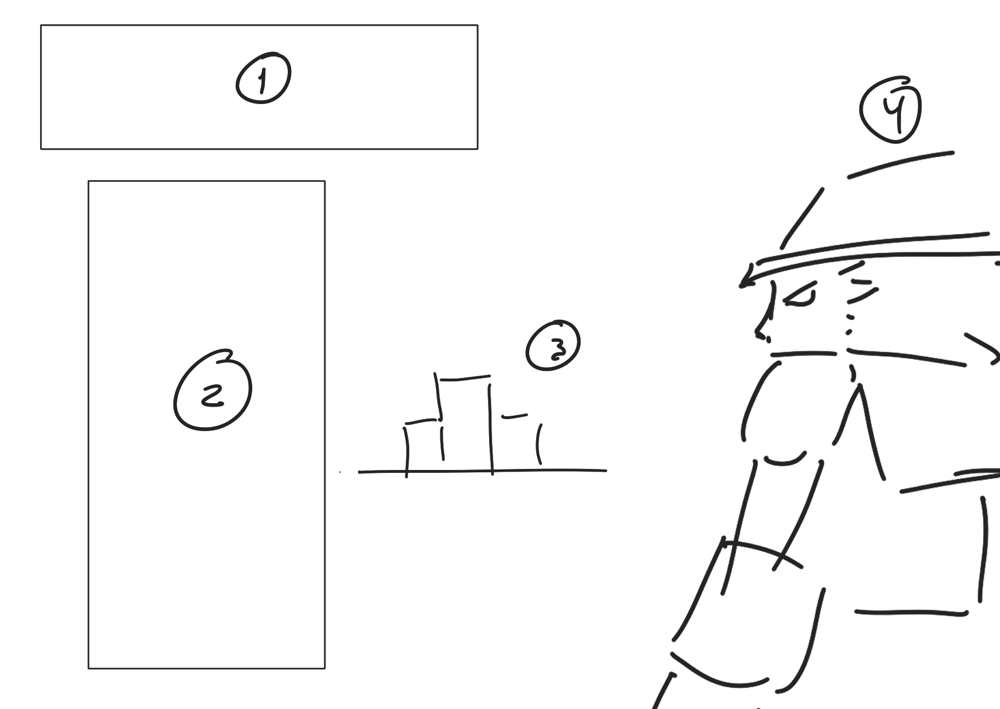

# PROYECTO COYOTE
**GAME DESIGN DOCUMENT**

Eduardo Almarza Blasco • Antonio Bernal de Celis • David del Castillo Enríquez • Diego Fernández Manso • Candela Jiménez González • Andrea Luengo Zazo

Version 1.0

# 0. Introducción
**Este documento presenta el diseño y desarrollo del videojuego “Proyecto Coyote”, donde se expondrá el proceso creativo a lo largo del tiempo hasta su lanzamiento final.**

“Proyecto Coyote” es un juego de acción frenética en 3D con cámara en tercera persona, centrado en la gestión de múltiples enemigos y el combate cuerpo a cuerpo. 

# 1. Concepto del juego 
"Proyecto Coyote” es un videojuego donde el jugador tomará el papel de un vaquero que quiere cumplir la última voluntad de su marido enterrando sus cenizas en un oasis cercano al pueblo donde nació, Pricklytown. Su viaje se complicará al llegar al poblado, que ha sido amenazado por una misteriosa infección desconocida que provoca mutaciones con forma de cactus en el cuerpo de quienes consumen el “sagrado” higo chumbo. 

# 2. Historia
## 2.1. Ambientación 
"Proyecto Coyote” se desarrolla en un viejo oeste fantástico y oscuro. En este mundo existen magias como la necromancia, criaturas sobrenaturales, animales antropomórficos, entre otros. 

La zona donde se desarrolla el videojuego es un área poblada en el desierto que se ha visto afectado por una misteriosa enfermedad que provoca mutaciones en el cuerpo y comportamientos agresivos.  

### Zonas de "Proyecto Coyote"

  ####  Pricklytown
  El protagonista llega inicialmente a Pricklytown, el único poblado de la zona. Se trata de un pequeño burgo muy aislado, habitado por diversas criaturas de personalidades extravagantes. Hay unas pocas viviendas, comercios variados, un peculiar cantina "El Revólver Revoltoso" y un cochambroso hostal para viajeros desafortunados que acaban en Pricklytown.

  ####  El Cañón
  Tras su visita por Pricklytown el protagonista se ve obligado a viajar hacia el oasis del sur, accesible únicamente a través de un cañón. Se trata de una zona desértica, seca y vacía. Hay algunas edificaciones de madera y carros abandonados, ya que esta ruta era empleada por los habitantes de Pricklytown para transportar agua antes de la construcción del pozo.

  ####  El Oasis
  El Oasis es una pequeña zona misteriosa y excesivamente frondosa. Los habitantes de Pricklytown afirman que, a pesar de contener agua, en el pasado prácticamente ninguna planta crecía en la zona, y que solo se conocía como oasis por tradición. Ahora es una exhuberante y densa jungla de todo tipo de cactus y plantas desérticas. En el oasis además hay una edificación puntiaguda que se asemeja a una iglesia.

  *Estos lugares, en cuestiones de gameplay, se traducen directamente como niveles o zonas de progreso que el jugador deberá atravesar*

## 2.2. Trasfondo
>*Existen manuscritos de eras ancestrales que teorizan sobre la existencia de unas cápsulas o huevos que surgieron con la creación del universo. En estas escrituras se les atribuye a estos huevos la capacidad de engendrar vida y alterar el entorno de su alrededor, consiguiendo habitar planetas yermos por completo.* 

### La sequía

En el periodo histórico actual, los habitantes de Pricklytown, un pequeño poblado en el desierto, excavaron un canal subterráneo para facilitar la llegada de agua desde un pequeño oasis cercano. Esta excavación interfirió con un artefacto extraño, de aspecto alienígena y orgánico que los mineros fueron incapaces de retirar y acabaron ignorando. 

Una vez inaugurado el canal, Pricklytown disfrutó de un corto periodo de abundancia gracias al nuevo acceso al manantial. Esta exhuberancia fue breve, pronto el agua escaseó, y tras una expedición, los vecinos del poblado descubrieron un bloqueo de vegetación en el oasis. 

Antes triste y prácticamente árido, el oasis se había transformado ahora en una jungla frondosa de vegetación desértica, con cactus y plantas que bloqueaban el aceso al agua. Este descubrimiento tenía un lado positivo para los vecinos, que pasaban por un periodo de hambruna, ya que este rápido crecimiento también había causado la fructificación de unos jugosos higos en los cactus a los que los habitantes de Pricklytown no pudieron resistirse.

Con el paso del tiempo las criaturas de la zona comenzaron a presentar malestar, aparentemente, debido al consumo del higo chumbo. Aquel que se alimentaba de los higos presentaba síntomas como deshidratación severa, cansancio y fiebre. Con el paso del tiempo, bultos y quistes verdosos brotaban en la piel y pronto se convertían en protuberancias vegetales y carnosas. 

### La expedición
El pueblo organizó una expedición formada por matasanos, voluntarios y miembros de la iglesia para investigar el cambiado oasis. Semanas después de su partida, menos de la mitad regresaron. Los expedicionarios parecían haber enloquecido y afirmaban que el consumo de el higo permitía a cualquier criatura alcanzar la inmortalidad.

Finalmente la misión fue considerada fallida y se atribuyeron los delirios de los supervivientes a la deshidratación.

### La llamada
Con el grave periodo de escasez al que se enfrentaba Pricklytown y la incomprensibilidad general de los efectos de los higos, resultó imposible evitar que los vecinos se alimentaran de ellos.
Quienes los consumían empeoraban con rapidez, y junto con los desagradables síntomas aparecían actitudes agresivas y destructivas. Los "infectados", como fueron etiquetados, eran trasladados recurrentemente al oasis por los pocos que resistían.

El acceso a la jungla de cactus era cada vez más complicado. Según algunos transportistas, desde las afueras de la zona vegetal se escuchaban cánticos inentendibles, pero que parecían atraer con un extraño magnetismo a quienes los escuchaban. Quienes eran capaces de ignorar la llamada la comparaban con la mitología sobre el canto de las sirenas, pero negaban su sobrenaturalidad y atrubuían la atracción al agua fresca del oasis.

<!--/Millones de años después, en medio del desierto, los habitantes del pueblo más cercano, Pricklytown, crearon un canal subterráneo para facilitar la llegada de agua gracias a un oasis cercano. Debido a estas obras despertaron a uno de estos huevos que creó unos misteriosos cactus que empezaron a brotar sobre él absorbiendo gran parte del agua del canal. De estos cactus se obtienen unos higos chumbos jugosos e irresistibles para los vecinos de Prickytown. La abundancia de estos frutos fue muy conveniente, ya que los vecinos pasaban por un periodo de hambruna./

A medida que fueron pasando el tiempo estos cactus los habitantes de Pricklytown y alrededores empezaron a presentar un malestar profundo debido al consumo del higo chumbo. Entre los síntomas se encuentran: deshidratación general, cansancio, fiebre, enrojecimientos de la piel y/o protuberancias con forma de espinas, y en muy pocos casos diarrea. 

Debido a lo ocurrido se mandó una expedición formada por matasanos, voluntarios y miembros de la iglesia. A medida que se iban acercando a la zona cero cuando el sol ya se había ocultado, algunos expedicionistas afirmaron haber visto algunos de estos cactus moverse. 

Al día siguiente de los 20 expedicionistas originales solo volvieron 7 cargados con bolsas llenas de aquellos higos. Cuando las familias y habitantes de Pricklytown y otros pueblos cercanos pidieron explicaciones de los que había ocurrido solo dijeron que ellos eran los elegidos por los dioses. Habían visto el maravilloso poder de los higos que, según ellos, era un milagro capaz de hacer inmortales a aquellos que los consumían permitiendo una mayor conexión el mundo espiritual, llegando a formar parte de él. 

Los bendecidos con el “milagro chungo” fueron llevados de forma voluntaria o forzada a la nueva iglesia formada por aquellos miembros eclesiásticos que habían sobrevivido para realizar cultos y rituales con ellos. El “culto del higo” se expandió poco a poco hasta formar un ejército de criaturas cactus sedientas que buscaban fuentes de agua, ya fueran pozos en los pueblos o criaturas, para crecer y aumentar en número provocando disturbios en las áreas cercanas. 

Año y medio después de los acontecimientos ocurrido empieza el viaje de nuestro protagonista.--> 
 
## 2.3. Personajes principales 

### Protagonisto
El protagonista de “Proyecto Coyote”, es un vaquero que se dirige al oasis de Pricklytown para enterrar las cenizas de su difunto marido. Se trata de un humano de 40 años, robusto, con una actitud ruda. En sus brazos posee unas ruedas de revolver que sirven para lanzar sus manos como si fueran un gancho. 

<!--### Personajes no jugables (NPCs)-->

### Enemigos 

Planteamiento de siluetas

  
  

### La infección
Los pocos doctores cuerdos que han sobrevivido a la infección han observado que su síntoma más vistoso es el crecimiento de protuberancias con forma de cactus en el cuerpo de la criatura afectada. Los infectados no parecen ser conscietes de sus acciones y aparentan obedecer a una fuerza extraña.

Los estados de transformación por el “milagro chungo” se han categorizado en 4 niveles según el tiempo que lleva el individuo enfermo. 

**Fases de contagio**

<table>
  <tr>
    <th style="width: 10%;">Fase</th>
    <th style="width: 70%;">Síntomas</th>
    <th style="width: 20%; text-align: center;">Aspecto</th>
  </tr>
  <tr>
    <td>1</td>
    <td>Primeros cinco días tras el consumo del higo. En este punto, los individuos no representan anomalías corporales, únicamente fiebre. El consumidor deja de tener hambre y sed y se siente saciado.</td>
    <td></td>
  </tr>
  <tr>
    <td>2</td>
    <td>En esta fase, a partir del quinto día hasta la segunda semana, el individuo empieza a presentar protuberancias en la piel, ahora áspera en la mitad superior del cuerpo, donde los pelos adoptan una postura rígida como si fueran espinas. Además de fiebre, los sujetos presentan síntomas de deshidratación, provocando en algunos casos diarrea.</td>
    <td></td>
  </tr>
  <tr>
    <td>3</td>
    <td>Tras las dos semanas del consumo del higo las protuberancias del nivel anterior crecen de forma significativa y obteniendo forma de cactus, el individuo presenta un nivel de deshidratación extremo provocando la desaparición de sus ojos. Su piel ha perdido su color natural y los síntomas del primer nivel han desaparecido. Los sujetos pierden el sentido del habla y tienen movimientos toscos.</td>
    <td></td>
  </tr>
  <tr>
    <td>4</td>
    <td>A este punto los individuos ya se vuelven irreconocibles. Su cuerpo presenta deformaciones extremas con forma de cactus, tienen un comportamiento agresivo y cuando están en grupo parecen seguir ordenes de algún modo.</td>
    <td></td>
  </tr>
</table>

 
 

# 3. Jugabilidad 
Al tratarse de un videojuego en 3D y tener un combate frenético donde te enfrentas a distintos enemigos, hay que tener en cuenta como se va a mover el jugador y como se va a enfrentar a estos enemigos. 

## 3.1. Mecánicas de interacción y movimiento
El jugador se desplaza en tres dimensiones en el escenario de juego y puede realizar las siguientes acciones: 

### **Desplazamiento horizontal**
El jugador puede desplazarse en cualquier dirección horizontalmente y correr de forma limitada.
### **Desplazamiento vertical** 
El personaje tiene un **gancho** que le ayuda con la movilidad y la gestión de enemigos. Además de engancharse a zonas concretas para moverse por el mapa. El jugador puede usar el gancho para atraer enemigos hacia él o para acercarse a ellos. Esto depende del botón que pulse el jugador, es decir, si usa el gancho y se mueve hacia delante irá donde esté el gancho, mientras que si se mueve para atrás lo que tenga el gancho será atraido hacia el jugador.

Cuando se ha usado el gancho este tendrá una recarga progresiva y no se podrá usar hasta que se haya cargado de nuevo. Para hacer más rápida esta carga el jugador tendrá la posibilidad de recargar la mitad del gancho si realiza un parry a un enemigo.

El gancho cuenta con una logitud máxima de 6 metros y se desactivará la opción de usarlo con enemigos cuando se encuentre a una distancia inferios a 1,5 metros pues no se considera necesario su utilidad a esas distancias.

## 3.2. Sistema de combate y vida
### **Estilo duelo** 
El jugador puede fijar a un enemigo cuando está a cierta distancia pudiendo esquivar sus ataques (se muestra por pantalla la dirección del ataque). Si esquivas el ataque en el momento perfecto, el jugador realiza un parry bloqueando el ataque y stunneando al enemigo durante un muy corto periodo de tiempo. Habrá enemigos con ataques especiales que no se podrán esquivar o parrear obligando al jugador a desfijarlo para no recibir el daño. 

Si el jugador consigue derrotar al enemigo fijado, se enfocará automaticamente al enemigo de al lado si es que existe. 

### **Ataque** 
El jugador puede atacar en varias direcciones.

  * Izquierda: input de dirección izquierda (A/joystick) + golpear.

  * Centro: sin input de dirección + golpear.

  * Derecha: input de dirección derecha (D/joystick) + golpear.

En el caso que el jugador utilice el input de dirección adelante o atrás junto al botón de ataque se interpretará como un ataque al centro.

Si un jugador ataca en la misma dirección en la que un enemigo está bloqueando, esté realizará un contratrataque al jugador poniendolo en un aprieto.

### **Esquives**
El jugador tendrá que esquivar los ataques de los enemigos para no sufrir demasiado daño. Estos ataques se categorizan en dos tipos:

- **Ataques primarios** Son los recibidos por el enemigo fijado. Pueden venir por la derecha, izquierda o centro. Para contrarrestarlos el jugador puede realizar las siguientes acciones:

  - **Esquive**: dentro de una ventana de frames, el jugador puede esquivar en la misma dirección que el ataquea para no sufrir daño observando 3 posibles direcciones:
    
    * Izquierda: input de dirección izquierda (A/joystick) + esquivar.

    * Centro: sin input de dirección + esquivar.

    * Derecha: input de dirección derecha (D/joystick) + esquivar.

    La dirección en la que el jugador tiene que esquivar viene indicada tanto en la interfaz como en la dirección física de la animación de ataque del enemigo. En caso de esquivar en una dirección contraria a la indicada el jugador recibirá daño. Así mismo, los enemigos también bloquearán los ataques del jugador bajo las mismas normas.

  - **Esquive perfecto**: un esquive en el momento exacto (con una ventana de frames más pequeña que el esquive normal) produce un bloqueo. Los bloqueos suponen mayor riesgo y recompensa, pudiendo dejar al enemigo aturdido si se ejecutan correctamente y pudiendo contraatacar como respuesta. Los bloqueos se realizan en las mismas direcciones que los esquives.

- **Ataques secundarios** Son los ejecutados por enemigos no fijados, que pueden atacarte por la espalda o dispararte.
  
  * Si el jugador no ha fijado ningún enemigo, puede esquivar ataques o disparos gracias a los frames de invulnerabilidad que otorga el esquive. Un esquive en el momento exacto puede ayudar a salir de la trayectoria del ataque o a omitirlo por completo si se hace correctamente.

  * Si el jugador tiene fijado a un enemigo, el resto entrarán en un estado de "Kung fu Circle", donde se turnarán para atacar al jugador de manera controlada, complicando los enfrentamientos con varios enemigos al mismo tiempo, pero haciéndolos plausibles. Si el jugador va a recibir un ataque o disparo de un enemigo no fijado mientras está en estado de combate, puede introducer el imput **esquivar + dirección atrás (s/joystick)** para realizar un esquive que le protegerá de recibir daño.

De esta forma se recompensa por realizar esquives y bloqueos correctos, fomentando esto como mecánica principal de la jugabilidad de "Proyecto Coyote".

### **Vida**
El jugador contará con 5 puntos de vida los cuales de pueden recargar de dos formas:

  1. **Botiquines**: En los niveles el jugador podrá encontrar botiquines en zonas de transición entre combates. Estos botiquines restauran 2 puntos de vida.

  2. **Recuperar vida**: Cuando recibes un ataque de un enemigo ya sea en el estilo duelo o no, los corazones quedan quitados correspondiendo al daño inflijido. Si el jugador realiza un esquive perfecto durante un combate fijado podrá recuperar la vida que le fue quitada. Si el jugador vuelve a recibir un ataque y no ha podido recuperar los corazones quitados, esos corazones desaparecerán y los corazones quitados pasarán a ser los inflijidos por el último ataque. Si un enemigo realiza un ataque que tiene más daño que corazones porta el jugador este morirá automaticamente.

  

### **Comportamiento enemigos**

El comportamiento de los enemigos varía dependiendo del lo que haga el jugador:

  * **Estado ilde**: Cuando los enemigos no detectan al jugador al estar fuera de su rango de visión u oculto, estarán en estado ilde dando vueltas o quedandose quietos realizando una animación predefinida. A este estado también volverán los enemigos cuando el jugador se aleje lo suficiente de estos tras ser detectado probocando que lo dejen de perseguir.

  * **Estado combate**: Si el jugador es detectado por un enemigo este le atacará a distancia o se acercará para pegarle. Si otros enemigos ven a uno de ellos ponerse en este modo buscarán al jugador para atacarle también.

## 3.3. Controles 

MECÁNICA              | TECLADO     | Dispositivos táctiles
--                    | --          | --
MOVIMIENTO DE CÁMARA  | RATÓN       | Joystick tactil der.
MOVIMIENTO            | W,A,S,D     | Joystick tactil izq.
CORRER                | SHIFT       | 
GANCHO                | E           |
ATAQUE PRINCIPAL      | CLICK IZQ.  |
ESQUIVE/BLOQUEO         | ESPACIO     |

## 3.4. Tipos de enemigos 

### Enemigos melee 
Los enemigos meele como su nombre indica atacan a corta distancia. Son resistentes a los ataques y no poseen armas a distancia con las que atacar.

#### Enemigo base melee

Este enemigo es el primero que se le presenta al jugador como tutorial y por lo tanto el más sencillo de combatir. Este enemigo tiene un rango de detección de 7 metros, pega con sus puchos y hacen 1 de daño al jugador con cada golpe. Este enemigo consta de 5 puntos de vida y 3 patrones de combate:
  1. Dos ataques izquierdos y uno ataque central.
  2. Ataque derecho, bloqueo derecho y bloqueo izquierdo.
  3. Defensa central, ataque central, defensa izquierda y ataque izquierda.

#### Enemigo suicida
Este enemigo busca provocar el mayor daño posible al jugador. Cuando entra en su campo de visión (7 metros) va corriendo tras él y, cuando se encuentra a una distancia inferior a un metro, se lanza hacia el jugador creando una explosión que acaba con su vida y provoca 3 de daño si no se esquiva. Si el jugador usa el gancho contra él, el enemigo explotará cuando el jugador lo atraiga o vaya hacia él.

Para poderse librar de este enemigo existen varias opciones:

  * Cuando el jugador se mueve por el escenario, si realiza un esquive en el momento justo no recibirá ningún daño.

  * Si el jugador fija a este enemigo, este realizará un ataque suicida en una de las tres direcciones de forma aleatoria. Si se esquiva en la dirección correcta no se recibirá daño y si realiza un esquive perfecto realizará un contraataque que hará detonar al enemigo saliendo ileso. Si el jugador ataca primero al enemigo este se preparará para detonar, en este caso el jugador tendrá que desfijar al enemigo y alejarse para salir ileso.

### Enemigos a distancia 
Los enemigos a distancia son unos grandes pistoleros, pero son muy débiles a los golpes por lo que intentarás zafarse del jugador cuando está cerca.

#### Francotirador
Como su nombre indica este enemigo porta un arma con forma de francotirador, pudiendo detectar al jugador en un rango de 14 metros. Sus disparos tienen un daño de 2 dorazones y tranda unos 5 segundo en poder volver a disparar. Este enemigo cuenta con 3 puntos de vida. Cuando el jugador enfoca a este enemigo adopta una postura defensiva y si ataca realiza 1 de daño. Tiene los siguientes 3 patrones:

  1. Defensa izquierda, defensa derecha y defensa central.
  2. Defensa central, defensa derecha y defensa central.
  3. Defensa derecha, ataque izquierdo y defensa izquierda.

### Enemigos mixtos 
Los enemigos mixtos son una combinación entre los enemigos a melee y a distancia, teniendo resistencia a los golpes y capaces de usar armas de media distancia.

#### Enemigo base mixto
Este enemigo cuenta con unos brazos que son escudos y pistolas a la vez. Su rango de disparo y deteción es de 9 metros e intenta mantener algo de distancia con el jugador. Realiza dos disparos segudos con un tiempo de recarga de 1 segundo antes de volver a disparar 2 veces. Este enemigo cuenta con 4 puntos de vida y los siguientes patrones de combate cuando entra en estilo duelo (cada ataque quita 1 corazón):

  1. Defensa tanto por la izquierda y derecha a la vez, y luego un ataque central.
  2. Dos ataques centrales segudos.
  3. Ataque derecho, defenza izquierda, ataque izquierdo y defensa central.

# 4. Arte 

A continuación se hará un resumen del apartado artístico general de Proyecto Coyote, desde el arte conceptual, inspiraciones y paletas de color hasta el arte final que se utilice en el juego. Para información más detallada sobre guías de diseño y modelado, procesos de trabajo y especificaciones artísticas, consultar el **documento de estilo**.

## 4.1. Estilo artístico general

Como ya se ha mencionado el juego estará completamente implementado en 3D, tanto escenarios como personajes. Por una combinación de necesidades técnicas y decisiones artísticas, los 

## 4.2. Personajes
(Aquí metemos el modelado de los personajes más en detalle, turnarounds y demás, en Personajes (2.3) ponemos beauty/ concept y tirando)
## 4.3. Escenarios
Como se ha mencionado anteriormente, "Proyecto Coyote" cuenta con tres zonas principales,cada una de estas zonas será un único nivel por lo tanto, el juego contará con tres niveles bien diferenciados. Para la introducción y la transición de niveles se meterán cinemáticas simulando ser un comic.

<!--### Pueblo
### Cañón
### Oasis-->

## 4.4. Arte 2D

# 5. Sonido y música 
## 5.1. Estilo Sonoro y musical
La música será ambientada en bandas sonoras del oeste para el menú de introducción, y temas de acción y aventura para el gameplay. Se usará el software “Musescore” para la composición de las canciones. Algunos instrumentos empleados serán el banjo o la trompeta entre otros.

Por otra parte, los sonidos y efectos especiales (SFX) tendrán una temática 8 bits, para acompañar la estética visual del juego. Se emplearán páginas como SFXR o BFXR.

<!--## 6.2. Banda sonora 
## 6.3. Efectos sonoros (SFX) -->

# 6. Menús e Interfaces 
## 6.1. Diagramas de flujo 

### Menú inicio

### Menú opciones

### In game

### Requisitos funcionales
__Menú inicio:__ El menú de inicio es lo primero que se encuentra el jugador cuando inicia el juego. En este menú se pueden observar los siguientes botones:
 
 * __Nueva partida:__ El jugador comienza el juego desde 0.
 
 * __Continuar:__ El jugador continua la partida desde el punto donde lo había dejado en caso de tener una partida guardada, si no la tiene no pasará nada.
 
 * __Controles:__ El jugador podrá ver los controles tanto en ordenador como dispositivos móviles.
 
 * __Opciones:__ El jugador accederá al menú de opciones donde podrá ajustar los niveles de audio general, música y efectos sonoros.
 
 * __Créditos:__ El jugador accede a la pantalla de créditos donde aparecerá los miembros que conforman el equipo y su trabajo realizado.
 
 * __Contenido descargable:__ Al pulsar este botón se desplegará una pantalla donde se podrá observar el contenido descargable de pago que contiene le juego.
 
 * __Salir:__ Con este botón el jugador saldrá del juego.

__In game:__ Para acceder al menú de pausa es tendrá que pulsar la tecla "esc" en ordenador o el respectivo botón en dispositivos móviles.

 * __Menú pausa:__ En este menú se presentan tres opciones al jugador:
   
    1. __Salir:__ permite al jugador volver al menú inicial.
       
    3. __Reintentar:__ resetea el nivel volviendo a iniciar desde la cinemática.
       
    5. __Reanudar:__ vuelve al nivel en el momento que lo pausó.

 * __Muere:__ Cuando el personaje muere se presenta ante él una pantalla de Game Over con dos opciones:
   
    1. __Reintentar:__ vuelve al último Check point.
       
    3. __Salir:__ vuelve al menú inicial.
       
 * __Termina el nivel:__ Al completar el nivel se presentan dos situaciones. Si hay otro nivel después se pasará al siguiente, pero si ya ha terminado el juego irá a la pantalla de créditos y luego al menú inicio cuando acabe.

 ## 6.2. Diseño de interfaces
 ###  Menú principal

1.	Título del juego.

2.	Botones con las distintas opciones siguiendo el estilo del título.

3.	De fondo se ve el pueblo de Prinklytown.

4. El protagonista está de espaldas a la cámara mirando hacia el pueblo mientras se le mueve el poncho.

# 7. Modelo de Negocio y Monetización

## 7.1. Monetización

Al tratarse de un videojuego de acción frenética en tercera persona, el tipo de monetización que más encaja con nuestro tipo de juego es ***Buy to Play***. 

Pese a ser de pago único, se pondrá a la venta un **early access** para los jugadores que quieran jugar el juego aunque no esté terminado, se habilitará la opción de hacer **pedidos anticipados** y se abre la puerta a la posibilidad de comercializar **DLCs** en función del éxito que tenga el juego.

PRODUCTO              |  PRECIO
--                    |  --     
Juego base  |   20 €
DLC: libro de arte |   7.5 €

## 7.2. Planificación y Costes
### El equipo humano
  * __Antonio__:	Diseñador de sonido y programador.
  * __Diego__:	Programador.
  * __Candela__:	Artista 2D, artista 3D y animadora 3D.
  * __Edu__:		Artista 2D, artista 3D y animador 3D.
  * __Andrea__:	Programadora.
  * __David__:	Game designer y guionista.

### Estimación temporal del desarrollo

La realización del proyecto tendrá un tiempo límite de 13 semanas teniendo en cuenta una subdivisión en distintas etapas:

  *	Versión Alpha (semana 5): Para esta versión del juego se tendrá programada una versión simple del combate, donde habrá un jugador y un enemigo que entra en combate. Esta versión contará con un tutorial para que se entienda bien las mecánicas principales.

  * Versión Beta (semana 9): Para esta versión se tendrán montados los niveles, enemigos y programado y mejorado mecánicas como el gancho, el combate o la cámara. Se intentará tener texturizado la gran mayoría de los elementos del juego, igual que un sistema de interfaces y menús funcionales e intuitivos.

  * Versión Release (semana 13): Esta es la versión final del juego. Aquí se mostrará el juego terminado habiendo pasado por un testeo, corrección de errores y terminado de añadir detalles menores del mismo.

Durante estas versiones cada semana se pondrán metas a alcanzar para el final de esta.

### Costes adicionales

#### Costes del personal
Estos serían los costes directos de la empresa, The Big Bone Team, asumiendo que el proyecto va a durar 13 semanas:

MIEMBRO DEL EQUIPO  |  ROL | COSTE POR HORA (€) | COSTE MENSUAL (€) | COSTE TOTAL (€)
--  |  -- |  -- |  --  |  --  
Andrea |   Programadora | 20 | 2400 | 7800
Antonio | Diseñador de sonido y programador | 25 | 3000 | 10050
Candela | Artista 2D, artista 3D y animadora 3D | 15 | 1800 | 5850
Diego | Programador | 25 | 3000 | 10050
David | Game designer y guionista | 15 | 1800 | 5850
Edu | Artista 2D, artista 3D y animador 3D | 15 | 1800 | 5850
__Total__ | - | 85 | 10200 | 45450

#### Licencias y software
CONCEPTO | COSTE MENSUAL (€) | COSTE TOTAL (€)
-- | -- | --
Internet | 60 | 195
Unity: Licencia Pro | 925 | 3006.25
Procreate | (coste único) | 14.99
Clip Studio | (coste único) | 49
Github | Licencia gratuita | 0
Aseprite | Licencia gratuita| 0
Miro | Licencia gratuita | 0
Jira | Licencia gratuita| 0
Mocrosoft Teams | Licencia gratuita| 0
Blender | Licencia gratuita | 0
MuseScore | Licencia gratuita | 0
Google Docs | Licencia gratuita | 195
__Total__ | 985 | 3265.34

#### Otros gastos
CONCEPTO | COSTE MENSUAL (€) | COSTE TOTAL (€)
-- | -- | --
Alquiler oficina | 800 | 2600
Internet | 60 | 195
Equipos | (coste único) | 5000
Servicios externos (testers) | 500 | 3000
__Total__ | 2285 | 10795

# 8. Marketing y Redes Sociales

Para publicitar el juego se han creado distintas redes sociales como Instagram, Youtube, X, ... El uso de estas redes sociales serán para presentar los distintos integrantes del equipo y los pequeños avances que se hagan conforme avanza el tiempo.

El público objetivo de este proyecto son personas adolescentes mayores de 16 años con interés y algo de experiencia en videojuegos de combate frenético en tercera persona, que sientan atracción por los mundos de fantasía, el viejo oeste o por la estética lovecraftiana, por lo que habrá que enfocar el marketing hacia dicho público.

# 9. Post Mortem

## 9.1. Post Mortem - Alfa

### Eduardo Almarza Blasco
#### Lecciones aprendidas
#### Trabajo individual realizado
#### Trabajo colectivo realizado

### Antonio Bernal de Celis
#### Lecciones aprendidas
#### Trabajo individual realizado
#### Trabajo colectivo realizado

### David del Castillo Enríquez
#### Lecciones aprendidas
#### Trabajo individual realizado
#### Trabajo colectivo realizado

### Diego Fernández Manso
#### Lecciones aprendidas
#### Trabajo individual realizado
#### Trabajo colectivo realizado

### Candela Jiménez González
#### Lecciones aprendidas
#### Trabajo individual realizado
#### Trabajo colectivo realizado

### Andrea Luengo Zazo
#### Lecciones aprendidas
#### Trabajo individual realizado
#### Trabajo colectivo realizado

<!--## 9.2. Post Mortem - Beta
## 9.3. Post Mortem - Gold-->
