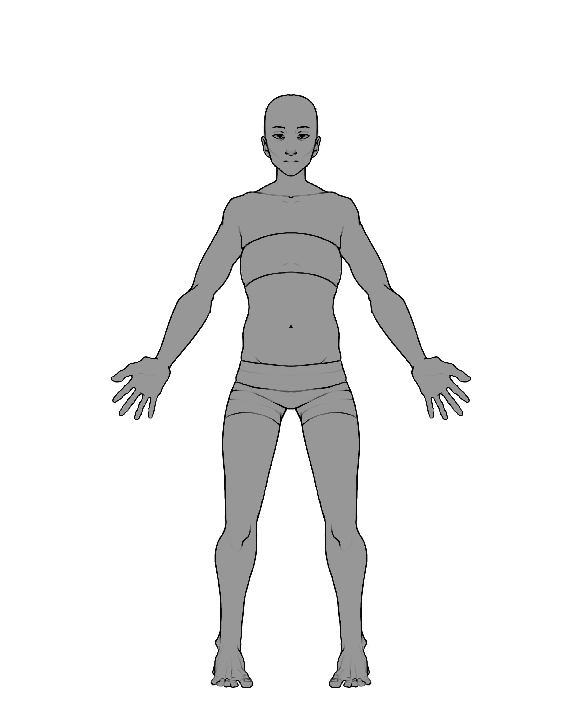

# PROYECTO COYOTE
**GAME DESIGN DOCUMENT**

Eduardo Almarza Blasco • Antonio Bernal de Celis • David del Castillo Enríquez • Diego Fernández Manso • Candela Jiménez González • Andrea Luengo Zazo 

# 1. Introducción
**Este documento presenta el diseño y desarrollo del videojuego “Proyecto Coyote”, donde se expondrá el proceso creativo a lo largo del tiempo hasta su lanzamiento final.**

“Proyecto Coyote” es un juego de acción frenética en 3D con cámara en tercera persona, centrado en la gestión de múltiples enemigos y el combate cuerpo a cuerpo. 

# 2. Concepto del juego 
"Proyecto Coyote” es un videojuego donde el jugador tomará el papel de un vaquero que quiere realizar la última voluntad de su marido enterrando sus cenizas en un oasis cercano al pueblo donde nació, Pricklytown. Su viaje se complicará al llegar al poblado, que ha sido amenazado por una misteriosa infección desconocida que provoca mutaciones con forma de cactus en el cuerpo de quienes consumen el “sagrado” higo chumbo. 

## Género 
"Proyecto Coyote” es un videojuego de acción en tercera persona con combates frenéticos donde hay que enfocar a los monstruos para entrar en combate mientras esquivas y atacas al enemigo en tres direcciones: derecha, izquierda y atrás.

## Plataformas 
“Proyecto Coyote” es un videojuego diseñado para su lanzamiento en web en Itch.io y estará disponible para ordenadores de sobremesa, portátiles y dispositivos móviles. 

## Características principales 
Dinámicas de juego

## Propósito y público objetivo 
"Proyecto Coyote” surgió con la intención de dar a conocer una combinación de géneros poco conocida: western combinado con fantasía oscura. 

El público objetivo de este proyecto son personas adolescentes mayores de 16 años con interés y algo de experiencia en videojuegos de combate frenético en tercera persona, que sientan atracción por los mundos de fantasía, el viejo oeste o por la estética lovecraftiana. 

## Monetización 
Tipo de monetización y tabla de productos y precios

## Planificación y coste ??

## Jugabilidad 
El juego se divide en dos modos de juego: libre y duelo.
El modo **libre** se refiere a cuando el jugador no está enfocando a ningún enemigo en concreto. Durante este modo el jugador podrá moverse libremente por el escenario pudiendo esquivar las balas y/o ataques, interactuar con los npcs y usar el gancho para atraer o moverse hacia enemigos u objetos. 

El modo **duelo** se produce cuando el jugador centra a un enemigo. En este modo de juego te puedes mover alrededor del enemigo y esquivar o atacarle por la derecha, izquierda y atrás/centro. El jugador podrá salir de este modo cuando derrote al enemigo o lo desenfoque a propósito.

## Estilo visual 
“Proyecto coyote” es un videojuego en 3D de estilo low poly. Los modelos, tanto de los personajes como de los escenarios, están texturizados siguiendo una estética pixel art con colores vivos.  

Con esta estética se ha obtenido un resultado bla bla bla 

# 3. Historia
## 3.1. Ambientación 
"Proyecto Coyote” se desarrolla en un viejo oeste fantástico y oscuro. En este mundo existen magias como la necromancia, criaturas sobrenaturales, animales antropomórficos, entre otros. 

La zona donde se desarrolla el videojuego es un área poblada en el desierto que se ha visto afectado por una misteriosa enfermedad que provoca mutaciones en el cuerpo y comportamientos agresivos.  

### Zonas de Proyecto Coyote

  ####  Pricklytown
  PROTA llega inicialmente a Pricklytown, el único poblado de la zona. Se trata de un pequeño burgo muy aislado, habitado por diversas criaturas de personalidades extravagantes. Hay unas pocas viviendas, comercios variados, un peculiar cantina "El Revólver Revoltoso" y un cochambroso hostal para viajeros desafortunados que acaban en Pricklytown.

  ####  El Cañón
  PROTA se ve obligado a viajar hacia el oasis del sur, accesible desde Picklytown únicamente a través de un cañón. Se trata de una zona desértica, seca y vacía. Hay algunas edificaciones de madera y carros abandonados, ya que esta ruta era empleada por los habitantes de Pricklytown para transportar agua antes de la construcción del pozo.

  ####  El Oasis
  El Oasis es una pequeña zona misteriosa y excesivamente frondosa. Los habitantes de Pricklytown afirman que, a pesar de contener agua, en el pasado prácticamente ninguna planta crecía en la zona, y que solo se conocía como oasis por tradición. Ahora es una exhuberante y densa jungla de todo tipo de cactus y plantas desérticas. En el oasis además hay una edificación puntiaguda que se asemeja a una iglesia.

  *Estos lugares, en cuestiones de gameplay, se traducen directamente como niveles o zonas de progreso que el jugador deberá atravesar*

  
 

## 3.2. Trasfondo
>*Existen manuscritos de eras ancestrales que teorizan sobre la existencia de unas cápsulas o huevos que surgieron con la creación del universo. En estas escrituras se les atribuye a estos huevos la capacidad de engendrar vida y alterar el entorno de su alrededor, consiguiendo habitar planetas yermos por completo.* 

### La sequía

En el periodo histórico actual, los habitantes de Pricklytown, un pequeño poblado en el desierto, excavaron un canal subterráneo para facilitar la llegada de agua desde un pequeño oasis cercano. Esta excavación interfirió con un artefacto extraño, de aspecto alienígena y orgánico que los mineros fueron incapaces de retirar y acabaron ignorando. 

Una vez inaugurado el canal, Pricklytown disfrutó de un corto periodo de abundancia gracias al nuevo acceso al manantial. Esta exhuberancia fue breve, pronto el agua escaseó, y tras una expedición, los vecinos del poblado descubrieron un bloqueo de vegetación en el oasis. 

Antes triste y prácticamente árido, el oasis se había transformado ahora en una jungla frondosa de vegetación desértica, con cactus y plantas que bloqueaban el aceso al agua. Este descubrimiento tenía un lado positivo para los vecinos, que pasaban por un periodo de hambruna, ya que este rápido crecimiento también había causado la fructificación de unos jugosos higos en los cactus a los que los habitantes de Pricklytown no pudieron resistirse.

Con el paso del tiempo las criaturas de la zona comenzaron a presentar malestar, aparentemente, debido al consumo del higo chumbo. Aquel que se alimentaba de los higos presentaba síntomas como deshidratación severa, cansancio y fiebre. Con el paso del tiempo, bultos y quistes verdosos brotaban en la piel y pronto se convertían en protuberancias vegetales y carnosas. 

### La expedición
El pueblo acordó organizar una expedición formada por matasanos, voluntarios y miembros de la iglesia para investigar el cambiado oasis. Semanas después de su partida, menos de la mitad regresaron. Los expedicionarios parecían haber enloquecido y afirmaban que el consumo de el higo permitía a cualquier criatura alcanzar la inmortalidad.

La misión fue considerada fallida y se atribuyó la insanidad de los supervivientes a la deshidratación.

### La llamada
Con el grave periodo de escasez al que se enfrentaba Pricklytown y la incomprensibilidad general de los efectos de los higos, resultó imposible evitar que los vecinos se alimentaron de ellos.
Quienes los consumían empeoraban con rapidez, y junto con los desagradables síntomas aparecían actitudes agresivas y destructivas. Los "infectados", como fueron etiquetados, eran trasladados recurrentemente al oasis por los pocos que resistían.

El acceso a la jungla de cactus era cada vez más complicado. Según reportes de algunos transportistas, desde las afueras de la zona vegetal se escuchaban cánticos inentendibles, pero que parecían atraer con un extraño magnetismo a quienes los escuchaban. Quienes eran capaces de ignorar la llamada la comparaban con la mitología sobre el canto de las sirenas, pero negaban su sobrenaturalidad y atrubuían la atracción al agua fresca del oasis.

<!--/Millones de años después, en medio del desierto, los habitantes del pueblo más cercano, Pricklytown, crearon un canal subterráneo para facilitar la llegada de agua gracias a un oasis cercano. Debido a estas obras despertaron a uno de estos huevos que creó unos misteriosos cactus que empezaron a brotar sobre él absorbiendo gran parte del agua del canal. De estos cactus se obtienen unos higos chumbos jugosos e irresistibles para los vecinos de Prickytown. La abundancia de estos frutos fue muy conveniente, ya que los vecinos pasaban por un periodo de hambruna./

A medida que fueron pasando el tiempo estos cactus los habitantes de Pricklytown y alrededores empezaron a presentar un malestar profundo debido al consumo del higo chumbo. Entre los síntomas se encuentran: deshidratación general, cansancio, fiebre, enrojecimientos de la piel y/o protuberancias con forma de espinas, y en muy pocos casos diarrea. 

Debido a lo ocurrido se mandó una expedición formada por matasanos, voluntarios y miembros de la iglesia. A medida que se iban acercando a la zona cero cuando el sol ya se había ocultado, algunos expedicionistas afirmaron haber visto algunos de estos cactus moverse. 

Al día siguiente de los 20 expedicionistas originales solo volvieron 7 cargados con bolsas llenas de aquellos higos. Cuando las familias y habitantes de Pricklytown y otros pueblos cercanos pidieron explicaciones de los que había ocurrido solo dijeron que ellos eran los elegidos por los dioses. Habían visto el maravilloso poder de los higos que, según ellos, era un milagro capaz de hacer inmortales a aquellos que los consumían permitiendo una mayor conexión el mundo espiritual, llegando a formar parte de él. 

Los bendecidos con el “milagro chungo” fueron llevados de forma voluntaria o forzada a la nueva iglesia formada por aquellos miembros eclesiásticos que habían sobrevivido para realizar cultos y rituales con ellos. El “culto del higo” se expandió poco a poco hasta formar un ejército de criaturas cactus sedientas que buscaban fuentes de agua, ya fueran pozos en los pueblos o criaturas, para crecer y aumentar en número provocando disturbios en las áreas cercanas. 

Año y medio después de los acontecimientos ocurrido empieza el viaje de nuestro protagonista.--> 

### La infección
Los pocos doctores cuerdos que han sobrevivido a la infección han observado que su síntoma más vistoso es el crecimiento de protuberancias con forma de cactus en el cuerpo de la criatura afectada. Los infectados no parecen ser conscietes de sus acciones y aparentan obedecer a una fuerza extraña.

Los estados de transformación por el “milagro chungo” se han categorizado en 4 niveles según el tiempo que lleva el individuo enfermo. 

**Fases de contagio**

<table>
  <tr>
    <th style="width: 10%;">Fase</th>
    <th style="width: 70%;">Síntomas</th>
    <th style="width: 20%; text-align: center;">Aspecto</th>
  </tr>
  <tr>
    <td>1</td>
    <td>Primeros cinco días tras el consumo del higo. En este punto, los individuos no representan anomalías corporales, únicamente fiebre. El consumidor deja de tener hambre y sed y se siente saciado.</td>
    <td></td>
  </tr>
  <tr>
    <td>2</td>
    <td>En esta fase, a partir del quinto día hasta la segunda semana, el individuo empieza a presentar protuberancias en la piel, ahora áspera en la mitad superior del cuerpo, donde los pelos adoptan una postura rígida como si fueran espinas. Además de fiebre, los sujetos presentan síntomas de deshidratación, provocando en algunos casos diarrea.</td>
    <td></td>
  </tr>
  <tr>
    <td>3</td>
    <td>Tras las dos semanas del consumo del higo las protuberancias del nivel anterior crecen de forma significativa y obteniendo forma de cactus, el individuo presenta un nivel de deshidratación extremo provocando la desaparición de sus ojos. Su piel ha perdido su color natural y los síntomas del primer nivel han desaparecido. Los sujetos pierden el sentido del habla y tienen movimientos toscos.</td>
    <td></td>
  </tr>
  <tr>
    <td>4</td>
    <td>A este punto los individuos ya se vuelven irreconocibles. Su cuerpo presenta deformaciones extremas con forma de cactus, tienen un comportamiento agresivo y cuando están en grupo parecen seguir ordenes de algún modo.</td>
    <td></td>
  </tr>
</table>

  
## 3.3. Personajes principales 

### Protagonisto
Protagonista de “Proyecto Coyote”, es un vaquero que se dirige al oasis de Pricklytown para enterrar las cenizas de su difunto marido. Se trata de un humano de 40 años, robusto, con una actitud ruda. En sus brazos posee unas ruedas de revolver que sirven para lanzar sus manos como si fueran un gancho. 

### Personajes no jugables (NPCs)

#### El tabernero tabernoso
Pues es un tío muy majo que te sirve cervecita de polvo

#### El tabernero tabernoso
Pues es un tío muy majo que te sirve cervecita de polvo

### Enemigos 

Planteamiento de siluetas

  
  

 
 

# 4. Jugabilidad 

## 4.1. Mecánicas de interacción y movimiento
El jugador se desplaza en tres dimensiones en el escenario de juego y puede realizar las siguientes acciones: 

#### **Desplazamiento horizontal**
El jugador puede desplazarse en cualquier dirección horizontalmente y correr de forma limitada.
#### **Desplazamiento vertical** 
El personaje tiene un **gancho** que le ayuda con la movilidad y la gestión de enemigos. Además de engancharse a zonas concretas (como en Sekiro) para moverse por el mapa, el jugador puede usar el gancho para atraer enemigos hacia él y para acercarse a enemigos. Se barajan dos opciones: 

1. El gancho te da 2 opciones: ir o traer. Al enganchar a un enemigo, el jugador se queda “enganchado” y puede pulsar W para ir hacia el enemigo o pulsar S para atraerlo. También hay enemigos especiales que no te permiten una de las dos opciones o incluso te las castigan. 

2. Si vas tú o viene el enemigo depende del peso del enemigo. Los enemigos grandes no pueden ser atraídos y los pequeños se atraen. 

Para el cooldown del gancho (se barajan 3 opciones): 

1. Cooldown normal (recarga lenta). 

2. Se recarga cada vez que hagas un parry (recompensa). 

3. Recarga con una tecla spammeandola (como dándole cuerda -> animación). 

#### **Lock - in** 
El jugador centra a un enemigo. Puede esquivar los ataques de los enemigos (se muestra por pantalla la dirección del ataque). Si esquivas el ataque en el momento perfecto (SFX o animación), el jugador realiza un parry (bloquea el ataque y stunnea al enemigo). 

Un enemigo puede atacarte desde atrás (disparo, lanzamiento...). Si realizas un parry / esquive normal, el jugador mantiene fijado al enemigo inicial. ¿Si te da el ataque, sales del modo fijado? 

Si el jugador no está a rango del enemigo, este no ataca. Si entra en su rango (y no tiene visión directa del jugador), no le ataca, pero se pone en guardia. Si tiene visión directa, sí ataca. ¿Fuego amigo? 

#### **Ataque** 
El jugador puede atacar en varias direcciones.

  * Izquierda 

  * Centro 

  * Derecha 

  * Atrás: te permite otro mov. (?) 

#### **Esquives**
El jugador tendrá que esquivar los ataques de los enemigos para no sufrir demasiado daño. Estos ataques se categorizan en dos tipos:
- **Ataques de frente. (primarios)** Son los recibidos por el enemigo fijado. Pueden venir de derecha, izquierda o frente. Para contrarrestarlos el jugador puede realizar las siguientes acciones:
  - Esquive / Bloqueo 
  - Dash

  CORREGIR:!!!!!!!!!!!!!!!!!!!!!!!!!!!!

  Un enemigo debe ser centrado para que el jugador lleve a cabo un combate efectivo contra él. En esta posición, el enemigo puede realizar ataques en distintas direcciones. 

  El combate del juego una vez cerrados los duelos es similar a Punch Out, donde existen varias direcciones (neutro, izq, der) en las que pueden ir dirigidos los ataques. Los ataques en una dirección se pueden evitar esquivando en esa misma dirección en una franja de tiempo determinada.  

- **Ataques laterales o traseros. (secundarios)** Son los ejecutados por enemigos no fijados, que pueden atacarte por la espalda y dispararte. Estos ataques pueden ser contrarrestados (se barajan tres opciones): 

  1. Con un mismo botón de esquive en el momento correcto, no recibes el golpe. 

  2. No hay esquive neutral. Este esquive trasero te permite defenderte de ataques traseros. S + botón de esquive bloquea ataques traseros. No existe SOLO el botón de esquive. 

  3. El esquive neutral solo se realiza sin pulsar ninguna tecla: botón de esquive. S + botón de esquive bloquea ataques traseros. CUATRO TIPOS DE ESQUIVES (derecha, izquierda, neutro y bloqueo trasero). POSIBLE OPCIÓN.

* Esquive. 

  * Izquierda: A + botón esquive 

  * Derecha: D + botón esquive 

  * Neutro: botón de esquive 

#### **Parry** 
Si el jugador esquiva en el momento preciso y en la dirección adecuada, podrá realizar un parry con una recompensa por determinar (stun al enemigo, ventana extra para golpear, doble de daño, etc, pistola, etc.) 

De esta forma se recompensa por realizar esquives y bloqueos correctos , fomentando esto como mecánica principal de la jugabilidad de Proyecto Coyote. 

## 4.2. Controles 

MECÁNICA              | TECLADO     | Dispositivos táctiles
--                    | --          | --
MOVIMIENTO DE CÁMARA  | RATÓN       |
MOVIMIENTO            | W,A,S,D     |
CORRER                | SHIFT       |
GANCHO                | E           |
ATAQUE PRINCIPAL      | CLICK IZQ.  |
ESQUIVE/DASH          | ESPACIO     |
PARRY                 | ?           |

# Interfaces 
## Diagramas de flujo 

### Menú inicio

### Menú opciones

### In game

### Requisitos funcionales
__Menú inicio:__ El menú de inicio es lo primero que se encuentra el jugador cuando inicia el juego. En este menú se pueden observar los siguientes botones:
 
 * __Nueva partida:__ El jugador comienza el juego desde 0.
 
 * __Continuar:__ El jugador continua la partida desde el punto donde lo había dejado en caso de tener una partida guardada, si no la tiene no pasará nada.
 
 * __Controles:__ El jugador podrá ver los controles tanto en ordenador como dispositivos móviles.
 
 * __Opciones:__ El jugador accederá al menú de opciones donde podrá ajustar los niveles de audio general, música y efectos sonoros.
 
 * __Créditos:__ El jugador accede a la pantalla de créditos donde aparecerá los miembros que conforman el equipo y su trabajo realizado.
 
 * __Contenido descargable:__ Al pulsar este botón se desplegará una pantalla donde se podrá observar el contenido descargable de pago que contiene le juego.
 
 * __Salir:__ Con este botón el jugador saldrá del juego.

__In game:__ Para acceder al menú de pausa es tendrá que pulsar la tecla "esc" en ordenador o el respectivo botón en dispositivos móviles.

 * __Menú pausa:__ En este menú se presentan tres opciones al jugador:
   
    1. __Salir:__ permite al jugador volver al menú inicial.
       
    3. __Reintentar:__ resetea el nivel volviendo a iniciar desde la cinemática.
       
    5. __Reanudar:__ vuelve al nivel en el momento que lo pausó.

 * __Muere:__ Cuando el personaje muere se presenta ante él una pantalla de Game Over con dos opciones:
   
    1. __Reintentar:__ vuelve al último Check point.
       
    3. __Salir:__ vuelve al menú inicial.
       
 * __Termina el nivel:__ Al completar el nivel se presentan dos situaciones. Si hay otro nivel después se pasará al siguiente, pero si ya ha terminado el juego irá a la pantalla de créditos y luego al menú inicio cuando acabe.

## Diseño de interfaces 
## Menú inicio

## In game 
## Fin de juego 
# ARTE 3D 
## Personajes 
### Referencias Estéticas 
### Vestuario 

### Personajes finales 
### NPCs 
#### LA CHAVALA CHUNGA ESTA 

### Referencias de Modelado 

### Props de Escenario 
### Referencias Estéticas 

# Game Design 
## Diseño de enemigos 
“Proyecto Coyote” consta de tres tipos de enemigos: melee, distancia y mixtos (combinación entre melee y distancia). 
### Enemigos melee 
Los enemigos a meele como su nombre indica atacan a corta distancia. Son resistentes a los ataques y no poseen armas a distancia con las que atacar. 
### Enemigos a distancia 
Los enemigos a distancia son unos grandes pistoleros, pero son muy débiles a los golpes por lo que intentarás zafarse del jugador cuando está cerca. 
### Enemigos mixtos 
Los enemigos mixtos son una combinación entre los enemigos a melee y a distancia, teniendo resistencia a los golpes y capaces de usar armas de media distancia. 
## Diseño de niveles 
“Proyecto Coyote” se divide en diferentes niveles con una ambientación única usando transiciones cinematográficas entre ellos para conectarlos. 
### Primer nivel 
#### Cinemática 
#### Diseño del nivel 
# Sonidos y música 
## Banda sonora 
## Efectos sonoros (SFX) 
